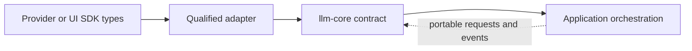

# Qualified adapters

Adapters translate an external SDK at the edge of llm-core. They implement or
project a neutral contract without letting provider-native objects become
portable state.

<<< @/snippets/v2/qualified-adapters.ts

## Import a qualified boundary

There is no public broad adapters barrel. Import only the adapter you use:

| Subpath                    | Boundary                                              |
| -------------------------- | ----------------------------------------------------- |
| `/adapters/ai-sdk`         | AI SDK 7 model, media, embedding, and reranking types |
| `/adapters/ai-sdk-ui`      | AI SDK UI event projection and WebSocket transport    |
| `/adapters/assistant-ui`   | assistant-ui projection and inbound parsing           |
| `/adapters/openai-chatkit` | OpenAI ChatKit event projection                       |
| `/adapters/nlux-ui`        | NLUX projection and chat adapter                      |

Qualified imports keep native peer dependencies and types at the edge. Install
the corresponding optional peer only when your application uses that subpath.

## Adapter guarantees

A useful adapter states:

- the exact native version or shape it supports;
- the neutral capability it implements;
- semantic loss at the translation boundary;
- which native metadata is omitted or redacted;
- the executable evidence behind its compatibility claim.

Adapter installation alone proves none of those claims.

Continue with [AI SDK model integration](/adapters/ai-sdk),
[UI projections](/adapters/ui), or
[runtime conformance](/adapters/runtime-conformance).
