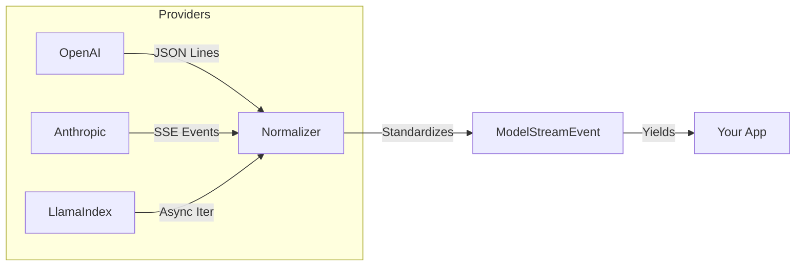

# Model Adapters: The Semantic Engine

## What is a Model Adapter?

In `llm-core`, a **Model** is a stateless engine that accepts a prompt composed of messages and returns a completion as plain text or structured data. The Model layer focuses on turning input into output in a predictable way, while the rest of the system takes care of orchestration, tools, and workflow state.

A **Model Adapter** acts as the driver for the underlying AI provider. You might call OpenAI through HTTP, run Llama 3 locally with Ollama, or talk to Anthropic through an SDK. Each of these providers exposes a different API surface. The Model Adapter hides those differences and presents a single, consistent contract to the rest of your application.

### Why use a Model Adapter?

Each AI ecosystem speaks its own dialect.

- OpenAI models receive a `messages` array such as `[{ role: "user", content: "..." }]`.
- Legacy LangChain integrations rely on `SystemMessage` objects and other wrapper classes.
- The Vercel AI SDK uses `LanguageModel` specifications in versions two and three.
- Anthropic exposes its own distinct message schema and calling conventions.

The `Model` adapter turns these variations into one unified shape. Your workflows always receive a `ModelResult` and a standard sequence of `ModelStreamEvent` values, even when you change providers or mix ecosystems inside a single project.

---

## Choosing your engine

`llm-core` supports the three major TypeScript AI ecosystems, and you can combine them inside one application. The best choice depends on the environment you deploy to and the providers you care about.

### 1. Vercel AI SDK

**Recommended for: modern applications, streaming, and edge deployments**

The Vercel AI SDK serves as the preferred driver for text generation in `llm-core`. It focuses on streaming performance and a clean, small surface area, which matches the design goals of this library.

It offers strong streaming support, a strict type system, and a lightweight dependency graph. The main trade-off lies in ecosystem age; LangChain still ships a wider set of niche provider integrations. When you build a new application or move an existing project toward edge-friendly infrastructure, this adapter usually provides the smoothest experience.

Reference from the upstream project: [`LanguageModel`](https://sdk.vercel.ai/docs/reference/ai-sdk-core/language-model-v1)

::: code-group

```bash [npm]
npm install ai @ai-sdk/openai
```

```bash [pnpm]
pnpm add ai @ai-sdk/openai
```

```bash [yarn]
yarn add ai @ai-sdk/openai
```

```bash [bun]
bun add ai @ai-sdk/openai
```

:::

::: tabs
== TypeScript

<<< @/snippets/adapters/model-ai-sdk.ts

== JavaScript

<<< @/snippets/adapters/model-ai-sdk.js

:::

### 2. LangChain JavaScript and TypeScript

**Recommended for: broad provider coverage and legacy systems**

LangChain ships a very large catalog of integrations. Projects that connect to AWS Bedrock, Google Vertex AI in older configurations, or bespoke enterprise LLM gateways often start their journey here. The LangChain adapter fits those situations and keeps the workflow surface in `llm-core` stable even as you move across providers in the LangChain ecosystem.

This approach brings impressive reach and plenty of building blocks across tools, retrievers, and storage back ends. The cost comes through heavier dependencies and some historical layers that grew over time inside the framework. When a project begins inside LangChain or depends on a provider that only offers LangChain bindings, this adapter meets the project on its own ground and then forwards a standard `ModelResult` back into your workflow.

Reference from the upstream project: [`BaseChatModel`](https://api.js.langchain.com/classes/core_language_models_chat_models.BaseChatModel.html)

::: code-group

```bash [npm]
npm install @langchain/core @langchain/openai
```

```bash [pnpm]
pnpm add @langchain/core @langchain/openai
```

```bash [yarn]
yarn add @langchain/core @langchain/openai
```

```bash [bun]
bun add @langchain/core @langchain/openai
```

:::

::: tabs
== TypeScript

<<< @/snippets/adapters/model-langchain.ts

== JavaScript

<<< @/snippets/adapters/model-langchain.js

:::

### 3. LlamaIndex

**Recommended for: deep RAG integration**

The LlamaIndex model adapter fits projects that use LlamaIndex as the primary retrieval and indexing engine. In those setups the chat engine, retrievers, and tools usually live inside LlamaIndex, while `llm-core` supplies the workflow layer around them.

This adapter keeps your LlamaIndex chat configuration close to the index definition, while still producing a familiar `ModelResult` and `ModelStreamEvent` lifecycle. For simple text generation tasks a direct AI SDK integration often feels leaner. For pipelines that lean heavily on query engines, response synthesis, and index-aware agents, the LlamaIndex adapter keeps everything aligned with that ecosystem.

Reference from the upstream project: [`LLM`](https://ts.llamaindex.ai/api/interfaces/LLM)

::: code-group

```bash [npm]
npm install llamaindex @llamaindex/openai
```

```bash [pnpm]
pnpm add llamaindex @llamaindex/openai
```

```bash [yarn]
yarn add llamaindex @llamaindex/openai
```

```bash [bun]
bun add llamaindex @llamaindex/openai
```

:::

---

## The streaming lifecycle

Streaming behaviour varies widely across providers. One service emits JSON lines, another emits raw bytes, and a third relies on server-sent events. Each format carries pieces of text, tool calls, and usage data in a slightly different way.

`llm-core` turns these variations into a single lifecycle of `ModelStreamEvent` values.



Chunk handling lives entirely inside the adapter. Your code consumes a typed async iterator and focuses on what each event represents rather than the protocol details that carried it over the wire.

::: tabs
== TypeScript

<<< @/snippets/adapters/model-stream.ts

== JavaScript

<<< @/snippets/adapters/model-stream.js

:::

---

## Media models with the Vercel AI SDK

Beyond text, `llm-core` ships adapters for multimodal generation. These adapters follow the Vercel AI SDK standards for image, speech, and transcription models, since that ecosystem provides a clear and stable definition for these capabilities.

### Image generation

Image models turn a text prompt into one or more images. The adapter implements an `ImageModel` interface inside `llm-core` and wraps an AI SDK `ImageModelV3` instance under the hood. You can swap providers or move from local inference to a hosted service while keeping the call site identical.

Upstream reference: [`ImageModelV3`](https://sdk.vercel.ai/docs/reference/ai-sdk-core/image-model)

::: tabs
== TypeScript

<<< @/snippets/adapters/model-image.ts

== JavaScript

<<< @/snippets/adapters/model-image.js

:::

### Speech: text to speech

Speech models convert text into audio blobs. The adapter exposes a `SpeechModel` interface and forwards to a Vercel AI SDK `SpeechModelV3` implementation. This keeps your workflow code focused on prompt construction, voice selection, and output routing, while the adapter handles differences between providers.

Upstream reference: [`SpeechModelV3`](https://sdk.vercel.ai/docs/reference/ai-sdk-core/speech-model)

### Transcription: audio to text

Transcription models convert audio blobs into text, a common pattern for systems that start from voice notes, support lines, and recorded meetings. The adapter implements a `TranscriptionModel` interface and forwards into a `TranscriptionModelV3` instance from the AI SDK.

Upstream reference: [`TranscriptionModelV3`](https://sdk.vercel.ai/docs/reference/ai-sdk-core/transcription-model)

---

## Supported model integrations

`llm-core` exposes factories that wrap the major ecosystem interfaces and yield a consistent `Model` contract.

| Ecosystem         | Adapter factory       | Upstream interface                  | Deep link                                                                                        |
| :---------------- | :-------------------- | :---------------------------------- | :----------------------------------------------------------------------------------------------- |
| **Vercel AI SDK** | `fromAiSdkModel`      | `LanguageModel` version one and two | [Docs](https://sdk.vercel.ai/docs/reference/ai-sdk-core/language-model-v1)                       |
| **LangChain**     | `fromLangChainModel`  | `BaseChatModel`                     | [Docs](https://api.js.langchain.com/classes/core_language_models_chat_models.BaseChatModel.html) |
| **LlamaIndex**    | `fromLlamaIndexModel` | `LLM`                               | [Docs](https://ts.llamaindex.ai/api/interfaces/LLM)                                              |

Each factory receives a provider-specific model instance and returns a `Model` that behaves like every other model inside `llm-core`. This keeps higher-level recipes, workflows, and UI layers independent from low-level details such as HTTP clients and SDK configuration.

## Supported media integrations

Media adapters focus on the Vercel AI SDK image, speech, and transcription primitives and surface them as first-class `llm-core` models.

| Capability                       | Adapter factory               | Upstream interface     | Deep link                                                                    |
| :------------------------------- | :---------------------------- | :--------------------- | :--------------------------------------------------------------------------- |
| **Image generation**             | `fromAiSdkImageModel`         | `ImageModelV3`         | [Docs](https://sdk.vercel.ai/docs/reference/ai-sdk-core/image-model)         |
| **Speech: text to speech**       | `fromAiSdkSpeechModel`        | `SpeechModelV3`        | [Docs](https://sdk.vercel.ai/docs/reference/ai-sdk-core/speech-model)        |
| **Transcription: audio to text** | `fromAiSdkTranscriptionModel` | `TranscriptionModelV3` | [Docs](https://sdk.vercel.ai/docs/reference/ai-sdk-core/transcription-model) |
