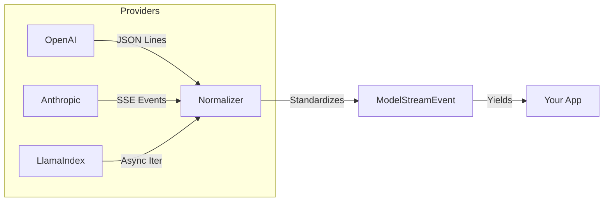

# Model Adapters (The Semantic Engine)

## What is a Model Adapter?

In `llm-core`, a **Model** is a stateless engine that accepts a prompt (messages) and returns a completion (text or structured data).

Think of the Model Adapter as the **driver** for the underlying AI provider. Whether you are calling OpenAI via HTTP, running Llama 3 locally via Ollama, or using Anthropic via an SDK, the Model Adapter normalizes the interaction into a single, predictable shape.

### Why do we need this?

Every AI provider speaks a different language:

- **OpenAI** expects `messages: [{ role: "user" }]`.
- **Legacy LangChain** might expect `SystemMessage` objects.
- **AI SDK** uses `LanguageModel` specifications (v2/v3).
- **Anthropic** has its own unique API signature.

The `Model` adapter standardizes all of this. It guarantees that no matter which provider you swap in, your Workflow receives the same `ModelResult` and standard `ModelStreamEvent`s.

---

## Choosing Your Engine

We support the three major TypeScript AI ecosystems. You can mix and match them within the same application.

### 1. AI SDK (Vercel)

**Recommended for: Modern Applications, Streaming, & Edge**

The Vercel AI SDK is our preferred driver for text generation. It creates the lightest, fastest, and most standard-compliant connections.

- **Pros**: Best-in-class streaming support, strictly typed, lightweight.
- **Cons**: Newer ecosystem, fewer niche provider integrations than LangChain.
- **Upstream Docs**: [`LanguageModel`](https://sdk.vercel.ai/docs/reference/ai-sdk-core/language-model-v1)

::: tabs
== TypeScript

<<< @/snippets/adapters/model-ai-sdk.ts

== JavaScript

<<< @/snippets/adapters/model-ai-sdk.js

:::

### 2. LangChain (JS/TS)

**Recommended for: Broad Provider Support & Legacy Apps**

LangChain has the largest catalog of integrations. If you need to connect to AWS Bedrock, Google Vertex AI (legacy), or a bespoke enterprise LLM gateway, LangChain is often the only driver available.

- **Pros**: Supports virtually every LLM API in existence.
- **Cons**: Heavier dependencies, legacy baggage.
- **Upstream Docs**: [`BaseChatModel`](https://api.js.langchain.com/classes/core_language_models_chat_models.BaseChatModel.html)

::: tabs
== TypeScript

<<< @/snippets/adapters/model-langchain.ts

== JavaScript

<<< @/snippets/adapters/model-langchain.js

:::

### 3. LlamaIndex

**Recommended for: Deep RAG Integration**

Use the LlamaIndex model adapter primarily when you are already using LlamaIndex for your retrieval pipeline and want to keep the "Chat Engine" tightly coupled to the index configuration.

- **Pros**: Seamless integration with LlamaIndex retrievers.
- **Cons**: Often overkill for simple text generation tasks.
- **Upstream Docs**: [`LLM`](https://ts.llamaindex.ai/api/interfaces/LLM)

---

## The Streaming Lifecycle

One of the hardest parts of building LLM apps is normalizing streams. Provider A emits chunks as JSON lines, Provider B emits raw bytes, Provider C emits SSE events.

`llm-core` normalizes **ALL** of them into a single lifecycle of `ModelStreamEvent` objects.

You never have to parse chunks manually. You just consume the iterator:

::: tabs
== TypeScript

<<< @/snippets/adapters/model-stream.ts

== JavaScript

<<< @/snippets/adapters/model-stream.js

:::

---

## Media Models (AI SDK)

Beyond text, we provide specialized adapters for multimodal generation. These rely heavily on the **AI SDK** standards, as it is the only ecosystem with a rigorous specification for these media types.

### Image Generation

Generates images from text prompts (DALL-E, Midjourney wrappers).

- **Interface**: `ImageModel`
- **Upstream**: [`ImageModelV3`](https://sdk.vercel.ai/docs/reference/ai-sdk-core/image-model)

::: tabs
== TypeScript

<<< @/snippets/adapters/model-image.ts

== JavaScript

<<< @/snippets/adapters/model-image.js

:::

### Speech (Text-to-Speech)

Converts text into audio blobs.

- **Interface**: `SpeechModel`
- **Upstream**: [`SpeechModelV3`](https://sdk.vercel.ai/docs/reference/ai-sdk-core/speech-model)

### Transcription (Audio-to-Text)

Converts audio blobs into text (Whisper).

- **Interface**: `TranscriptionModel`
- **Upstream**: [`TranscriptionModelV3`](https://sdk.vercel.ai/docs/reference/ai-sdk-core/transcription-model)

## Supported Integrations (Flex)

`llm-core` has native adapters for **every** major ecosystem interface.

| Ecosystem      | Adapter Factory       | Upstream Interface      | Deep Link                                                                                        |
| :------------- | :-------------------- | :---------------------- | :----------------------------------------------------------------------------------------------- |
| **AI SDK**     | `fromAiSdkModel`      | `LanguageModel` (V1/V2) | [Docs](https://sdk.vercel.ai/docs/reference/ai-sdk-core/language-model-v1)                       |
| **LangChain**  | `fromLangChainModel`  | `BaseChatModel`         | [Docs](https://api.js.langchain.com/classes/core_language_models_chat_models.BaseChatModel.html) |
| **LlamaIndex** | `fromLlamaIndexModel` | `LLM`                   | [Docs](https://ts.llamaindex.ai/api/interfaces/LLM)                                              |

## Supported Media Integrations (AI SDK)

`llm-core` exposes specific adapters for AI SDK's media models.

| Capability        | Adapter Factory               | Upstream Interface     | Deep Link                                                                    |
| :---------------- | :---------------------------- | :--------------------- | :--------------------------------------------------------------------------- |
| **Image Gen**     | `fromAiSdkImageModel`         | `ImageModelV3`         | [Docs](https://sdk.vercel.ai/docs/reference/ai-sdk-core/image-model)         |
| **Speech (TTS)**  | `fromAiSdkSpeechModel`        | `SpeechModelV3`        | [Docs](https://sdk.vercel.ai/docs/reference/ai-sdk-core/speech-model)        |
| **Transcription** | `fromAiSdkTranscriptionModel` | `TranscriptionModelV3` | [Docs](https://sdk.vercel.ai/docs/reference/ai-sdk-core/transcription-model) |
