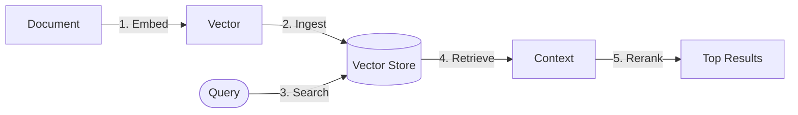

# Retrieval adapters (context and memory)

## What is retrieval?

Retrieval gives your LLM long term memory and access to private data. It sits between your raw content and the model and forms the core of Retrieval Augmented Generation, usually shortened to **RAG**.

In `llm-core`, retrieval sits inside a RAG pipeline. The [RAG recipe](/recipes/rag) explains the end to end flow from question to answer. This page focuses on the building blocks that make that flow work and the adapters that connect them.

You can read this page from top to bottom as a tour of the pipeline, or you can skip to a section when you want details about a particular adapter type.

The retrieval side of this pipeline is made of four distinct stages that work together:

1. **Embedders** turn text into vectors.
2. **Vector stores** save those vectors for later use.
3. **Retrievers** read relevant vectors during a workflow.
4. **Rerankers** refine the results with a high precision model.

### The RAG pipeline

The rest of this page follows the diagram from left to right. Each of the next sections introduces one stage and the adapters that implement it in `llm-core`.

Each stage has its own adapter interface in `llm-core`. You can plug in LangChain, LlamaIndex, AI SDK or your own code at any of these points and still keep a single, consistent workflow.

---

## 1. Retrievers

### The reading interface

A `Retriever` accepts a string query and returns a list of documents. It is a read only interface that focuses on search and ranking, not storage.

Retrievers are usually the first contact point between a user query and your stored knowledge. They decide which pieces of context reach the model, so the choice of implementation has a direct effect on answer quality.

### When to use which retriever

**LlamaIndex (`fromLlamaIndexRetriever`)** works well for complex data and richer indexing strategies. When you parse PDFs, build knowledge graphs, or use hierarchical indices, LlamaIndex gives you powerful building blocks. The adapter lets you use those retrievers inside `llm-core` recipes without giving up the rest of your stack.

- Upstream docs: [`BaseRetriever`](https://ts.llamaindex.ai/api/classes/BaseRetriever)

**LangChain (`fromLangChainRetriever`)** works well when you need wide database support. If you want to connect to a specific vector database such as Pinecone, Chroma or Qdrant and run similarity search, LangChain usually has the driver ready. The adapter keeps that driver and wraps it behind a stable `Retriever` interface.

- Upstream docs: [`BaseRetriever`](https://api.js.langchain.com/classes/core_retrievers.BaseRetriever.html)

You can mix both in the same project. For example, a LangChain based retriever can serve product search while a LlamaIndex based retriever can serve internal documentation, and both can feed the same `llm-core` recipes.

---

## 2. Vector stores

### The writing interface

A `VectorStore` adapter gives `llm-core` a way to write. While a retriever reads, a vector store adapter upserts and deletes records in a database agnostic way.

This covers three main operations:

- Upsert new or updated documents.
- Remove entries that no longer exist at the source.
- Fetch stored documents by identifier when needed.

### Why use an adapter

Every vector database SDK exposes a slightly different API. Some expect flat arrays of numbers, some expect named fields, and some expect extra metadata. An adapter hides that complexity.

In practice, this means you can write a generic ingestion recipe once and point it at Pinecone, Chroma, Qdrant or an in memory store without rewriting the orchestration code. You keep your indexing and sync logic in `llm-core` and let the adapter handle the storage details.

### Example: indexing a document

The following example shows how to wire a LangChain vector store for ingestion. The same pattern applies to other ecosystems that expose a compatible `VectorStore` interface.

::: tabs
== TypeScript

<<< @/snippets/adapters/vector-store-langchain.ts

== JavaScript

<<< @/snippets/adapters/vector-store-langchain.js

:::

---

## 3. Indexing, the sync problem

### Why `store.upsert` does not tell the whole story

A simple RAG pipeline often calls `store.upsert` for every document during every run. It looks fine at first, yet it creates three common problems over time.

First, cost grows quickly because you keep re embedding content that has not changed. Second, small edits or file moves can leave behind orphaned records that keep appearing in search results. Third, deletions at the source rarely propagate to the vector store, which means stale context can appear in responses.

### Indexing adapters

An indexing adapter sits between your source of truth and your vector store. It assigns and tracks a stable identifier for every document and stores a hash for the latest version that you ingested. During a new run, it compares the current state of the source with the stored hashes and performs the minimal set of operations required to bring the vector store in sync.

Source documents flow through the indexing adapter into the vector store.

`Source docs` → **`Indexing adapter`** → `Vector store`

This approach gives you predictable behaviour and a clear audit trail. When you look at your logs, you can see which documents were added, updated or marked as deleted during each ingestion pass.

### LangChain integration

LangChain supplies a `RecordManager` that implements this pattern. The `llm-core` adapter expects a LangChain `VectorStore` instance instead of an `llm-core` `VectorStore` adapter. Indexing logic runs inside that LangChain component, while the rest of your workflow can still use any model adapter from AI SDK, LangChain or LlamaIndex.

::: tabs
== TypeScript

<<< @/snippets/adapters/indexing-usage.ts

== JavaScript

<<< @/snippets/adapters/indexing-usage.js

:::

---

## 4. Embedders

### The meaning maker

Embedders convert text such as `"Hello world"` into high dimensional vectors such as `[0.1, -0.4, 0.8, ...]`. These vectors encode semantic information so that similar concepts end up close to each other in vector space.

Embedders sit at the front of the RAG pipeline. They decide how your documents are projected into that space, so they have a strong influence on retrieval quality.

### Dimensions and configuration

Each embedder produces vectors with a fixed number of dimensions. For example, OpenAI `text-embedding-3-small` uses 1536 dimensions. Your vector store must use the same number for the same index. When those numbers match, storage and retrieval stay consistent.

It helps to treat that pair as a contract. When you change embedder model, check the dimension count and adjust your vector store configuration or create a new index set aside for the new model.

### Ecosystem support

**AI SDK (`EmbeddingModel`)** is a good default when you want speed and a modern provider experience. It provides a type safe interface for models from OpenAI, Cohere, Mistral and others. The adapter wraps any `EmbeddingModel` and exposes it as an `llm-core` embedder.

- Upstream: [`EmbeddingModel`](https://sdk.vercel.ai/docs/reference/ai-sdk-core/embedding-model-v1)

**LangChain and LlamaIndex** shine when you already use their document loaders and text splitters. Many of their higher level components expect a specific `Embeddings` implementation. The adapters make those embedders available to `llm-core` recipes while leaving your upstream configuration untouched.

::: tabs
== TypeScript

<<< @/snippets/adapters/embedder-ai-sdk.ts

== JavaScript

<<< @/snippets/adapters/embedder-ai-sdk.js

:::

---

## 5. Rerankers

### The precision refiner

Vector similarity search retrieves candidates based on proximity in vector space. It provides a broad, fuzzy match that brings likely context into view, yet it does not always produce the best ordering for a specific question.

A reranker takes the top results from a retriever, such as the first 50 documents, and evaluates them with a more capable model. It then sorts them by relevance to the query and often trims the list further. The final answer uses that smaller, more focused set.

### Why reranking helps

Reranking raises answer quality by selecting context that addresses the user query directly. It reduces the chance that a loosely related paragraph slips into the prompt, and it often cuts down on hallucinations because the model sees fewer distractors.

Rerankers are particularly useful when you retrieve from very large corpora or when queries are short and ambiguous.

### Implementation

`llm-core` aligns with the AI SDK reranker standard, `RerankingModelV3`. The adapter accepts an AI SDK reranking model and exposes a unified reranker interface that fits cleanly into recipes.

::: tabs
== TypeScript

<<< @/snippets/adapters/reranker-ai-sdk.ts

== JavaScript

<<< @/snippets/adapters/reranker-ai-sdk.js

:::

---

## 6. Advanced retrieval utilities

Some ecosystems provide helpers that sit beside the core RAG pipeline. These helpers simplify certain patterns once your basic retrieval flow works well.

### Structured queries (LangChain)

#### The filter compiler

LangChain exposes a `StructuredQuery` type that powers self query retrievers and structured filters. The type describes both the user query and a filter expression in a single object.

The `llm-core` adapter normalises this shape so you can keep the same `StructuredQuery` handling while you mix in any model adapter in your recipes.

::: tabs
== TypeScript

<<< @/snippets/adapters/structured-query-langchain.ts

== JavaScript

<<< @/snippets/adapters/structured-query-langchain.js

:::

You can pass the resulting `StructuredQuery` into your own retriever filters or recipe steps. The model adapter can come from AI SDK, LangChain or LlamaIndex, and the filter logic stays consistent.

### Query engines, the black box path

#### When to use a query engine

Most `llm-core` examples encourage explicit recipes where you control each stage in the RAG flow. You see the `Retrieve → Rerank → Generate` chain and you decide how each step behaves.

Frameworks such as LlamaIndex also provide higher level query engines. These encapsulate complex retrieval logic such as sub question routing, tree summarisation and multi step reasoning. A query engine feels more like an oracle that accepts a question and returns an answer while it hides internal orchestration.

A query engine adapter is useful when you want to keep that advanced behaviour and still participate in the broader `llm-core` workflow.

Typical reasons include:

1. You rely on a specific LlamaIndex query engine that already works well in production.
2. You want to integrate that engine with new tools, guards or memory, and you prefer to do that in `llm-core`.
3. You treat the retrieval subsystem as a specialised service while the rest of the workflow remains explicit.

::: tabs
== TypeScript

<<< @/snippets/adapters/query-engine-llamaindex.ts#docs

== JavaScript

<<< @/snippets/adapters/query-engine-llamaindex.js#docs

:::

#### Response synthesis

A **response synthesiser** accepts a query and a set of retrieved nodes and produces a final answer. It represents the generation half of RAG when retrieval has already taken place elsewhere.

The LlamaIndex response synthesiser adapter lets you plug that component directly into a recipe. You can then decide whether a step uses an explicit `Model` adapter, a query engine or a response synthesiser, while the rest of the workflow stays the same.

::: tabs
== TypeScript

<<< @/snippets/adapters/response-synthesizer-llamaindex.ts#docs

== JavaScript

<<< @/snippets/adapters/response-synthesizer-llamaindex.js#docs

:::

---

## Supported integrations

The sections above explain the concepts and how they relate to RAG. The tables below collect the current adapter factories so you can quickly see which upstream types plug into each stage.

`llm-core` covers the full RAG pipeline: ingestion, embedding, storage, retrieval and reranking. The tables below show the current adapter factories and their upstream interfaces.

### Core RAG components

| Capability   | Ecosystem  | Adapter factory             | Upstream interface       | Deep link                                                                                                     |
| :----------- | :--------- | :-------------------------- | :----------------------- | :------------------------------------------------------------------------------------------------------------ |
| Retrieval    | LangChain  | `fromLangChainRetriever`    | `BaseRetriever`          | [Docs](https://api.js.langchain.com/classes/core_retrievers.BaseRetriever.html)                               |
| Retrieval    | LlamaIndex | `fromLlamaIndexRetriever`   | `BaseRetriever`          | [Docs](https://ts.llamaindex.ai/api/classes/BaseRetriever)                                                    |
| Vector store | LangChain  | `fromLangChainVectorStore`  | `VectorStore`            | [Docs](https://api.js.langchain.com/classes/core_vectorstores.VectorStore.html)                               |
| Vector store | LlamaIndex | `fromLlamaIndexVectorStore` | `BaseVectorStore`        | [Docs](https://ts.llamaindex.ai/api/interfaces/BaseVectorStore)                                               |
| Embeddings   | AI SDK     | `fromAiSdkEmbeddings`       | `EmbeddingModel`         | [Docs](https://sdk.vercel.ai/docs/reference/ai-sdk-core/embedding-model-v1)                                   |
| Embeddings   | LangChain  | `fromLangChainEmbeddings`   | `Embeddings`             | [Docs](https://api.js.langchain.com/interfaces/core_embeddings.EmbeddingsInterface.html)                      |
| Embeddings   | LlamaIndex | `fromLlamaIndexEmbeddings`  | `BaseEmbedding`          | [Docs](https://ts.llamaindex.ai/api/classes/BaseEmbedding)                                                    |
| Reranker     | AI SDK     | `fromAiSdkReranker`         | `RerankingModelV3`       | [Docs](https://sdk.vercel.ai/docs/reference/ai-sdk-core/rerank)                                               |
| Reranker     | LangChain  | `fromLangChainReranker`     | `BaseDocumentCompressor` | [Docs](https://api.js.langchain.com/classes/core_retrievers_document_compressors.BaseDocumentCompressor.html) |
| Reranker     | LlamaIndex | `fromLlamaIndexReranker`    | `BaseNodePostprocessor`  | [Docs](https://ts.llamaindex.ai/api/classes/BaseNodePostprocessor)                                            |

### Ingestion utilities

These adapters wrap upstream ETL tools so you can use them directly inside `llm-core` recipes.

| Capability | Ecosystem  | Adapter factory              | Deep link                                                                                       |
| :--------- | :--------- | :--------------------------- | :---------------------------------------------------------------------------------------------- |
| Loader     | LangChain  | `fromLangChainLoader`        | [Docs](https://api.js.langchain.com/classes/core_document_loaders_base.BaseDocumentLoader.html) |
| Loader     | LlamaIndex | `fromLlamaIndexLoader`       | [Docs](https://ts.llamaindex.ai/api/classes/BaseReader)                                         |
| Splitter   | LangChain  | `fromLangChainTextSplitter`  | [Docs](https://api.js.langchain.com/classes/textsplitters.TextSplitter.html)                    |
| Splitter   | LlamaIndex | `fromLlamaIndexTextSplitter` | Docs                                                                                            |
