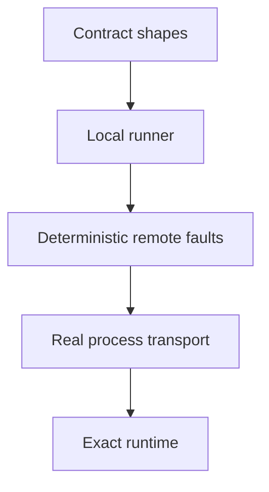

# Runtime conformance

Runtime neutrality is an executable claim. A runner must satisfy the same model, tool, control, event, state, and continuation expectations without relying on TypeScript implementation details.

## Assess a runtime adapter

| Level | Establishes |
| --- | --- |
| Contract | Portable values satisfy the closed shared contracts. |
| Local runner | Preparation, events, controls, effects, and terminal results obey the runner lifecycle. |
| Deterministic remote | Correlation, replay, drop, reorder, and timeout faults fail predictably. |
| Process transport | Framing and identity survive a real language boundary. |
| Exact runtime | The supported framework version executes its supported path under the dedicated suite. |

Each level adds evidence. A successful process handshake does not establish framework compatibility.

Apply the ladder to one adapter at a time. Require:

1. exact runtime and dependency versions;
2. exact portable and runtime-native operation identifiers;
3. the recognised contract, version, native owner, and executable fixtures for every supported operation;
4. explicit `unsupported` operations for applicable semantics the adapter does not preserve; and
5. exact-version source evidence for every `not-applicable` disposition.

Normalised portable events, results, and controls are separate operations from runtime-native events, sessions, checkpoints, dependencies, and provider state. Passing the portable fixture does not establish native-operation support or state interchangeability.

Portable terminal output is itself closed: text is `{ kind: "text", text: string }` and structured JSON is `{ kind: "json", value: JsonValue }`. A runtime adapter must reject native or provider fields at this boundary. Any qualified native result is exposed by a separate integration-owned operation and validated against its exact assessed shape, expected run identity, and portable terminal result.

Supported portable preparation and start operations snapshot their complete definition or input as strict JSON before reading any field. Accessor-backed, proxy, cyclic, symbolic, or otherwise non-data values fail before caller code can execute inside the adapter boundary.

Operation identifiers remain no broader than their fixtures. The PydanticAI reference currently qualifies only the assessed TestModel trajectory with one `echo(value: string)` call, its matching return, and the exact four-message prompt/call/return/text history. It does not claim generic PydanticAI function tools or message history.

The adapter page should publish this closed `supported`, `unsupported`, or `not-applicable` matrix. Keep exact versions, commands, suites, and reference targets in [packaging and conformance](/reference/conformance).

## Protocol conformance

A protocol adapter is qualified against its own recognised authority rather than the runtime ladder alone. The A2A and MCP package fronts therefore expose independent exact-operation matrices, retain native ownership for protocol facts, reject undeclared input at registration boundaries and fail explicitly for applicable unsupported operations.

The MCP surface is stateless per request. A trusted application binding owns tool and resource catalogues, request authorisation and handlers. Successful tool calls still pass through kernel schema validation, policy, approval, receipt and cancellation controls. The transport cannot grant itself those capabilities.

The A2A surface preserves remote identity, delegation, task state, artefacts, events, subscriptions and cancellation as A2A-native facts. No portable checkpoint, team or application-session contract is inferred from them.

Release qualification runs each surface's packed external-consumer fixture against the exact SDK versions declared by its operation matrix. A fixture for one protocol is not evidence for the other.
