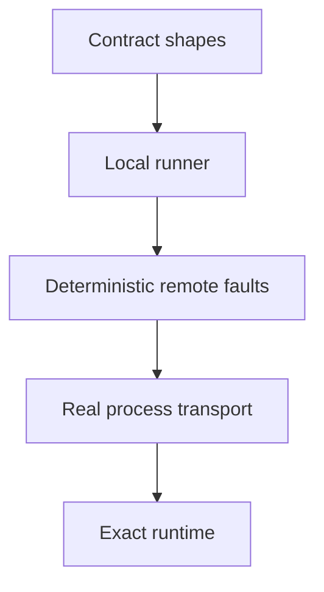

# Runtime conformance

Runtime neutrality is an executable claim. A runner must satisfy the same model,
tool, control, event, state, and continuation expectations without relying on
TypeScript implementation details.

## Assess a runtime adapter

| Level                | Establishes                                                                             |
| -------------------- | --------------------------------------------------------------------------------------- |
| Contract             | Portable values satisfy the closed shared contracts.                                    |
| Local runner         | Preparation, events, controls, effects, and terminal results obey the runner lifecycle. |
| Deterministic remote | Correlation, replay, drop, reorder, and timeout faults fail predictably.                |
| Process transport    | Framing and identity survive a real language boundary.                                  |
| Exact runtime        | The supported framework version executes its supported path under the dedicated suite.  |

Each level adds evidence. A successful process handshake does not establish
framework compatibility.

Apply the ladder to one adapter at a time. Require:

1. exact runtime and dependency versions;
2. the supported `AgentSpec` and input subset;
3. declared semantic loss;
4. unsupported controls and state lifetimes;
5. executable conformance evidence.

The adapter page should describe supported input/spec behavior, semantic loss,
and unsupported controls. Keep exact versions, commands, suites, and reference
targets in [packaging and conformance](/reference/conformance).
