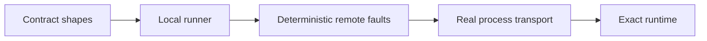

# Runtime conformance

Runtime neutrality is an executable claim. A runner must satisfy the same model,
tool, control, event, state, and continuation expectations without relying on
TypeScript implementation details.

## Conformance ladder

| Level                | Establishes                                                                             |
| -------------------- | --------------------------------------------------------------------------------------- |
| Contract             | Portable values satisfy the closed shared contracts.                                    |
| Local runner         | Preparation, events, controls, effects, and terminal results obey the runner lifecycle. |
| Deterministic remote | Correlation, replay, drop, reorder, and timeout faults fail predictably.                |
| Process transport    | Framing and identity survive a real language boundary.                                  |
| Exact runtime        | The assessed framework version executes its supported path under the dedicated suite.   |

Each level adds evidence. A successful process handshake does not establish
framework compatibility.

## PydanticAI reference boundary

The first exact Python target is `pydantic-ai-slim==2.19.0`. Its executable
matrix uses the assessed runtime and preserves actual tool-call identity,
arguments, results, and message history on the supported path.

The bounded reference runner declares unsupported semantics rather than
approximating them. It does not claim live cancellation, resume, authenticated
intervention, provider-session continuity, or meaningful-effect execution.
Missing PydanticAI, an unsupported Python or PydanticAI version, malformed
events, reordered lifecycle data, or an unsupported agent spec fails closed.

## Publication boundary

The PydanticAI bridge is conformance and reference infrastructure. It is not a
published package subpath. The shipped package exposes the neutral
`AgentRunner` contract; a production runtime adapter should qualify its own
public boundary and support statement.

When evaluating a runtime adapter, require:

1. exact runtime and dependency versions;
2. the supported `AgentSpec` and input subset;
3. declared semantic loss;
4. unsupported controls and state lifetimes;
5. executable conformance evidence.

See [packaging and conformance](/reference/conformance) for the package-level
test matrix.
