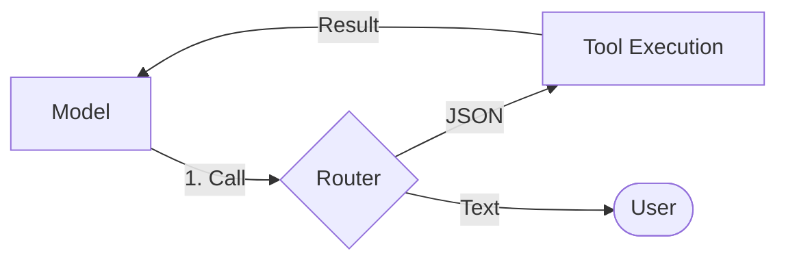

# Tools & Parsers (Agency & Logic)

## What is a Tool?

A Tool is what turns a Chatbot into an **Agent**. It allows the model to "reach out" of its text box to execute code, search the web, or query a database.

In technical terms, a Tool consists of:

1.  **Name**: What is it called? (e.g. `get_weather`).
2.  **Description**: When should the model use it?
3.  **Schema**: What arguments does it accept? (e.g. `{ city: string }`).
4.  **Implementation**: The actual JavaScript function to run.

### The Logic Loop

---

## 1. Tools Adapters

`llm-core` normalizes the wildest part of the ecosystem: **Schemas**.
Some libraries use Zod. Some use JSON Schema. Some use custom objects. We make them all interoperable.

### The "Native" Way (AI SDK / Zod)

**Recommended for: Building your own tools**

If you are writing a tool from scratch (e.g., an API wrapper for your app), use the AI SDK `tool` helper with Zod. It provides the best type inference and validation.

- **Upstream Docs**: [`tool`](https://sdk.vercel.ai/docs/reference/ai-sdk-core/tool)

::: tabs
== TypeScript

<<< @/snippets/adapters/tool-ai-sdk.ts

== JavaScript

<<< @/snippets/adapters/tool-ai-sdk.js

:::

### The "Catalog" Way (LangChain)

**Recommended for: Using pre-built integrations**

LangChain has thousands of pre-written tools (Google Search, Wikipedia, Zapier, Python Interpreters). Don't reinvent the wheel—use their catalog.

- **Upstream Docs**: [`Tool`](https://api.js.langchain.com/classes/core_tools.Tool.html)

::: tabs
== TypeScript

<<< @/snippets/adapters/tool-langchain.ts

== JavaScript

<<< @/snippets/adapters/tool-langchain.js

:::

---

## 2. Output Parsers

**Text-to-Structure**

Before "Function Calling" became standard in LLMs, we used **Output Parsers** to trick models into returning JSON by giving them strict instructions.

Today, you should mostly rely on **Native Structured Output** (supported by our Model adapters). However, Parsers are still useful for:

### When to use Parsers?

1.  **Legacy Models**: Older models (like Llama 2 or early GPT-3) do not natively support "Tool Calling" or JSON mode. Parsers are the _only_ way to get structure from them.
2.  **Clean Up**: Parsers can auto-fix common JSON errors (like trailing commas) that models often make.
3.  **Specific Formats**: If you need CSV, XML, or a custom regex extraction.

::: tabs
== TypeScript

<<< @/snippets/adapters/parser-langchain.ts

== JavaScript

<<< @/snippets/adapters/parser-langchain.js

:::

---

## Supported Integrations (Flex)

| Capability | Ecosystem  | Adapter Factory             | Upstream Interface        | Deep Link                                                                              |
| :--------- | :--------- | :-------------------------- | :------------------------ | :------------------------------------------------------------------------------------- |
| **Tool**   | AI SDK     | `fromAiSdkTool`             | `Tool` (Zod)              | [Docs](https://sdk.vercel.ai/docs/reference/ai-sdk-core/tool)                          |
| **Tool**   | LangChain  | `fromLangChainTool`         | `Tool` / `StructuredTool` | [Docs](https://api.js.langchain.com/classes/core_tools.Tool.html)                      |
| **Tool**   | LlamaIndex | `fromLlamaIndexTool`        | `BaseTool`                | [Docs](https://ts.llamaindex.ai/api/interfaces/BaseTool)                               |
| **Parser** | LangChain  | `fromLangChainOutputParser` | `BaseOutputParser`        | [Docs](https://api.js.langchain.com/classes/core_output_parsers.BaseOutputParser.html) |
