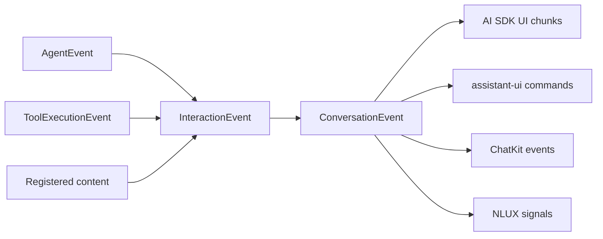

# UI projections

UI adapters consume projected `ConversationEvent` values and emit a target
library's presentation protocol. Extension mappers may accept canonical
`InteractionEvent` values and project them first. Either input has crossed
llm-core's identity, ordering, and redaction boundaries.

## AI SDK UI

`createAiSdkUiProjectionMapper` maps text and reasoning deltas, tool calls and
results, message boundaries, errors, and status data into `UIMessageChunk`
values. Tool input and output are already safe JSON.

The same subpath exports `createAiSdkUiWebSocketTransport`. See
[reconnect and transport](/interaction/transport) for its closed wire protocol.

## assistant-ui

`createAssistantUiProjectionMapper` buffers text until a message finishes and
emits assistant message or tool-result commands. Reasoning is excluded by
default and can be included with an explicit prefix.

`parseAssistantUiInboundEvents` is the reverse edge for supported inbound
assistant-ui context. Parsing does not turn UI input into policy or effect
authorization.

## OpenAI ChatKit

`createChatKitProjectionMapper` emits ChatKit response start, response end,
error, and effect events. Tool effect events contain safe identity facts, not
raw arguments or results.

## NLUX

`createNluxProjectionMapper` maps interaction content to streaming text,
completion, or error signals. `createNluxChatAdapter` goes one step further: it
starts an `InteractionSession` for NLUX batch and streaming calls, then
delivers the projected text through the NLUX observer contract.

`InteractionSession` here is the explicit extension API. Common application
code uses `createConversation` and consumes `ConversationEvent` directly.

## Authority stays behind the projection

Every UI adapter is presentation-only. It does not:

- execute a tool;
- authenticate an approval;
- create or persist a receipt;
- reserve a conversation revision;
- make a snapshot resumable;
- establish provider or runtime compatibility.
