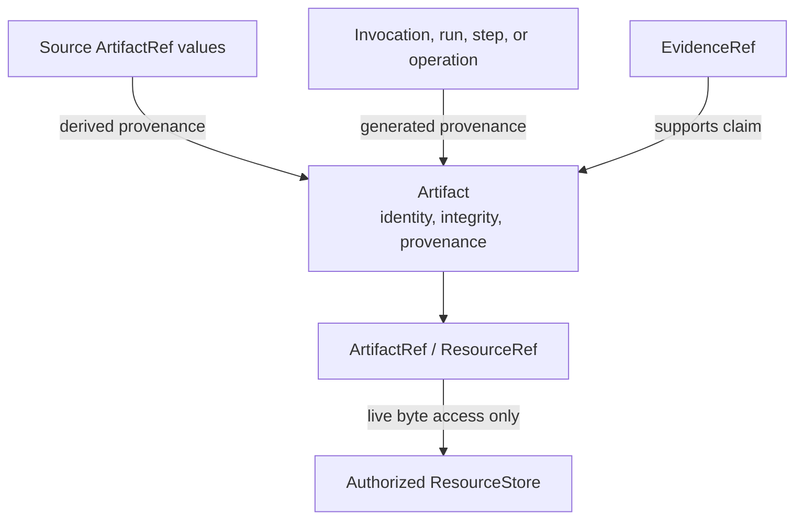

# Artifacts

An `Artifact` describes a portable output by identity, integrity, optional
schema, provenance, and JSON metadata. Its `ArtifactRef` wraps a `ResourceRef`;
the bytes remain behind an authorized resource store.

<<< @/snippets/v2/artifact-provenance.ts

Artifact provenance is one of:

| Kind        | Meaning                                                 |
| ----------- | ------------------------------------------------------- |
| `supplied`  | The artifact entered from outside the current execution |
| `generated` | An invocation, run, or step produced it                 |
| `derived`   | An operation transformed one or more source artifacts   |

All three forms can cite an `EvidenceRef`. Creation rejects physical locators,
malformed integrity metadata, secret-bearing fields, native objects, and
undeclared keys. The resulting artifact is cloned and frozen.

The artifact contract does not imply storage. Pair it with an application-owned
`ResourceStore` when execution must read or write bytes.

