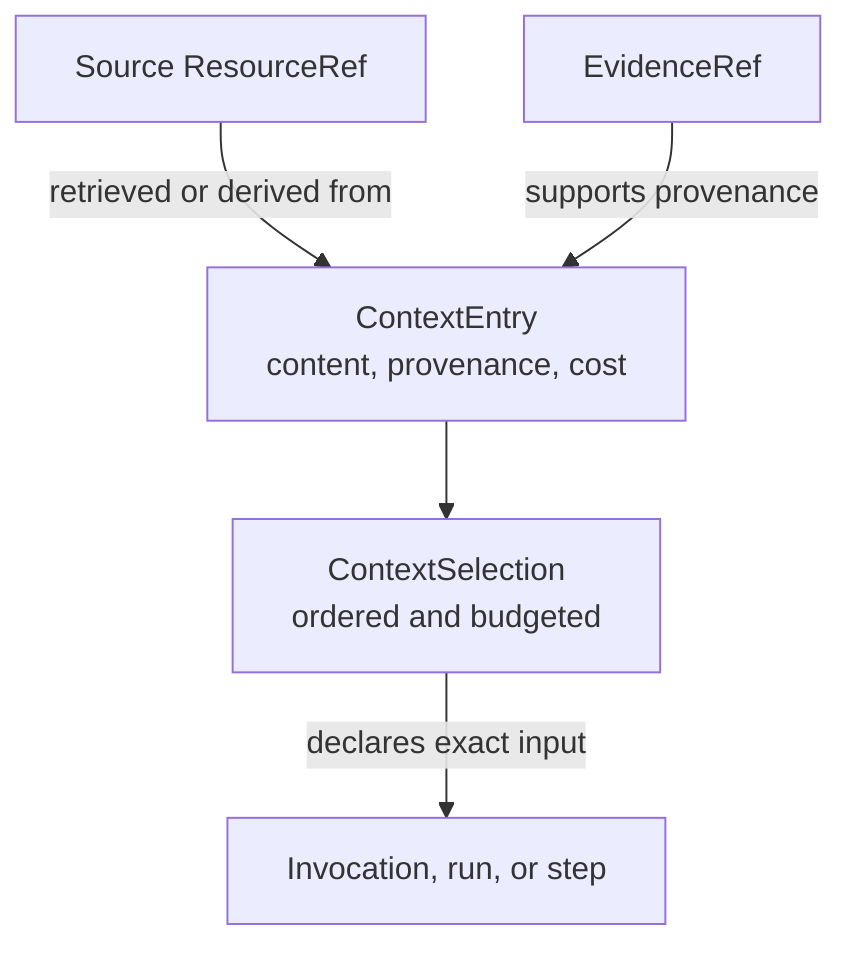

# Context

A `ContextSelection` records exactly what entered an invocation, run, or step.
Each entry has portable content or a storage-neutral reference, provenance,
priority, and cost. The manifest applies an explicit entry, byte, and optional
token budget.

<<< @/snippets/v2/context-selection.ts

`selectContext` validates budget accounting, rejects duplicate entries,
derives canonical digests, clones the input, and freezes the result. Entry
order remains meaningful even though JSON object key order is canonicalized.

## Context is not a dependency container

The manifest records execution input. It does not carry model clients, storage
ports, credentials, or arbitrary application services. Live capabilities enter
through composition, while `InvocationContext` carries identity and authority.

Provenance distinguishes application, system, or user-supplied content from
derived and retrieved content. Retrieved entries can link to both their source
`ResourceRef` and supporting `EvidenceRef`.

