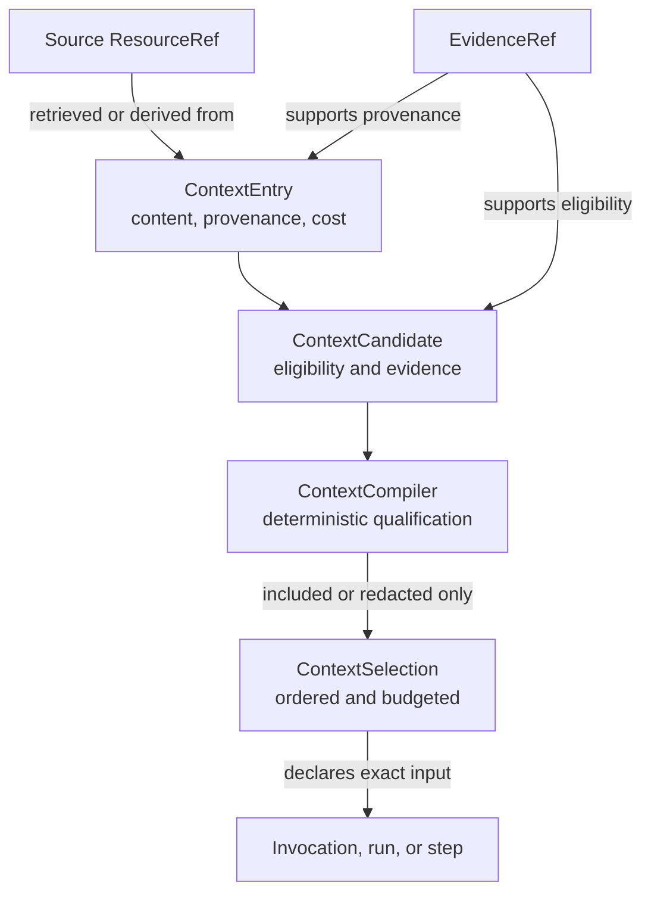

# Context

A `ContextSelection` records exactly what entered an invocation, run, or step. Each entry has portable content or a storage-neutral reference, provenance, priority, and cost. The manifest applies an explicit entry, byte, and optional token budget.

<<< @/snippets/v2/context-selection.ts

`selectContext` validates budget accounting, rejects duplicate entries, derives canonical digests, clones the input, and freezes the result. Entry order remains meaningful even though JSON object key order is canonicalized.

## Compile eligible context first

`ContextSelection` is an input record, not an authorization grant. When an application must decide whether a source may enter a prompt, use the provider-neutral `ContextCompiler` with declarative, evidence-bearing candidates. The compiler evaluates the supplied source authorization, tenant/purpose applicability, classification ceiling, explicit freshness instant, prompt-injection treatment, precedence, and budget before producing a selection.

```ts
import { createContextCompiler } from "@geekist/llm-core/context";

const compiler = createContextCompiler();
const compilation = compiler.compile({
  scope,
  tenantId,
  purpose: "assistant.reply",
  asOf: "2026-08-01T00:00:00.000Z",
  maxClassification: "internal",
  budget: { maxEntries: 8, maxBytes: 24_000, maxTokens: 6_000 },
  candidates,
});
```

Each candidate is represented in immutable `compilation.evidence`, including whether it was included, redacted, or excluded and why. A denied, stale, over-classified, tenant/purpose-inapplicable, unsafe, duplicate, or over-budget candidate never silently reaches `compilation.selection`. A redaction treatment requires an already-sanitized replacement entry; the original content is never selected or repeated in exclusion evidence.

The compiler does not call a policy service, classify content automatically, or read the ambient clock. Composition supplies the eligibility facts and uses the explicit `asOf` value, making the outcome deterministic and auditable.

## Context is not a dependency container

The manifest records execution input. It does not carry model clients, storage ports, credentials, or arbitrary application services. Live capabilities enter through composition, while `InvocationContext` carries identity and authority.

Provenance distinguishes application, system, or user-supplied content from derived and retrieved content. Retrieved entries can link to both their source `ResourceRef` and supporting `EvidenceRef`.


