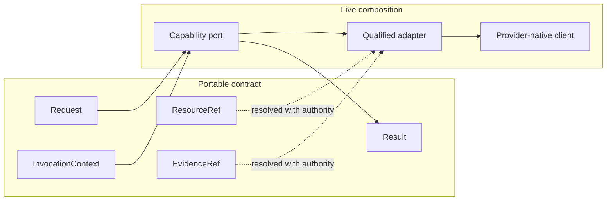

# Contracts and portability

The `/contracts` subpath contains the values that cross capability boundaries: opaque identifiers, semantic versions, schema references, resource references, evidence references, invocation context, and evidence-backed capability claims.

Portable values are plain, structured-cloneable data. Live ports, credentials, provider clients, sockets, and database handles stay outside them.

`ResourceRef` identifies bytes by opaque UUID, media type, byte length, and digest. `EvidenceRef` adds an evidence kind and its own opaque identity. Neither contains a URL, path, credential, or disclosure grant.

<<< @/snippets/v2/contracts-portability.ts

## Extensions and capability claims

Extension objects use reverse-DNS keys and strict JSON values. Capability claims are versioned and evidence-backed. A `supported` claim carries passing conformance evidence; `conditional` and `unsupported` remain explicit so resolution can fail without silently weakening a requirement.

Use `InvocationContext` to pass execution identity and authority separately from the portable request. This keeps requests reusable and makes authority visible at the call site.
