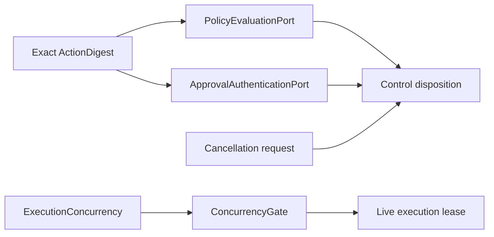

# Control

Control contracts make authority decisions explicit. Policy evaluation,
approval authentication, cancellation, and concurrency are separate ports
because each answers a different question.

Intervention requests and decisions belong to the
[state capability](/capabilities/state). Durable intervention sequencing belongs
to [workflow orchestration](/orchestration/workflows).

<<< @/snippets/v2/control-policy.ts

`authorizePolicyDecision` verifies that the returned policy decision is bound
to the expected run, tool call, and action digest. Missing, malformed, or
mismatched decisions are denied.

## Meaningful effects fail closed

These contracts contribute independent control facts; the capability does not
sequence them. The canonical ordering, including receipt reservation,
authorization, lease acquisition, execution, and durable completion, lives in
[Controlled tool execution](/orchestration/controlled-tool-execution).

The receipt reservation and concurrency lease solve different problems. The
receipt journal establishes durable effect identity and recovery. The gate
limits overlapping live execution. An `EventSink` emits a best-effort redacted
projection but replaces neither mechanism.

Retry after an effect starts requires verified idempotency or reconciliation.
A caller-provided label does not establish either guarantee.
