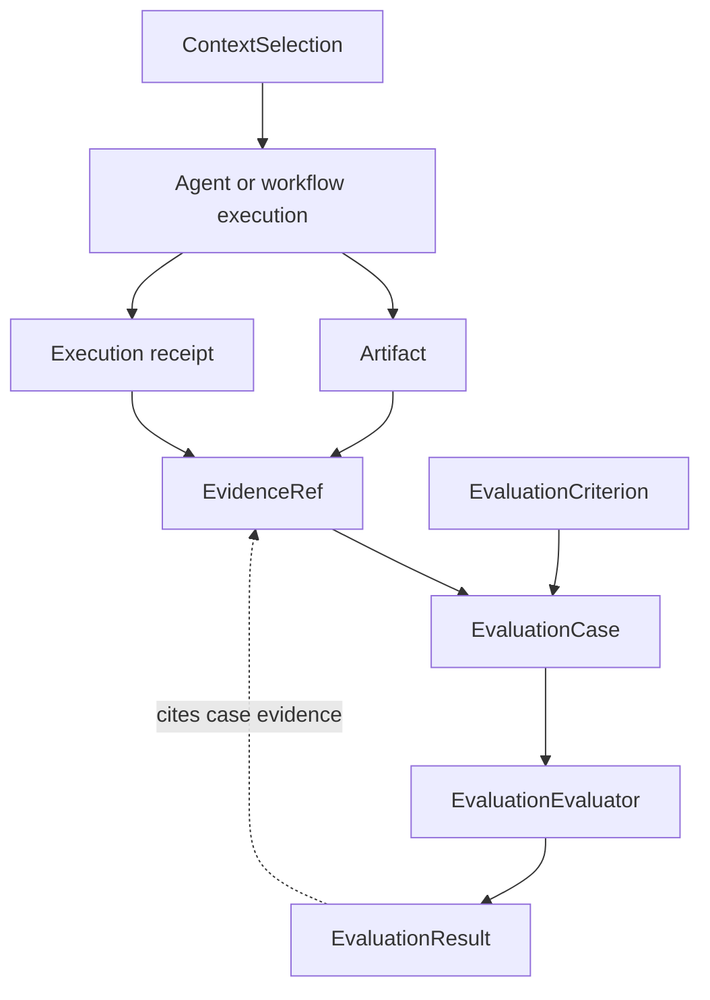

# Evaluation

Evaluation binds judgements to explicit criteria and recorded evidence. `EvaluationCase` contains a stable case identifier, weighted criteria, and the only evidence evaluators may cite.

<<< @/snippets/v2/evaluation-composition.ts

`createEvaluationComposition` validates evaluator descriptors, orders evaluators deterministically, and stamps every result with the registered evaluator identity and case identity. A judgement can report `pass`, `fail`, or `inconclusive`.

Scores refer only to criteria declared by the case. Result evidence must be drawn from that case, so an evaluator cannot quietly introduce an unrecorded source. Synchronous compositions remain synchronous; the result becomes asynchronous only when an evaluator does.

Evaluation is provider-neutral. A model-based judge can be supplied as an evaluator, but its provider client and prompts remain live implementation details.

An evaluation result is evidence for the declared case and criteria only. A downstream product may cite it when classifying a relationship or assessing a declared outcome, but the result does not create project truth, approve an intervention, define accepted work or establish causation. Those judgements retain their own authority, provenance and conclusion basis in the consuming product.

## Qualification and promotion

`createEvaluationQualification` binds measured results to immutable dataset, split, baseline, candidate, evaluator, assertion, and evidence identities. A qualification declares normalized criterion thresholds and derives whether the measurements qualify; optional uncertainty is retained only when the evaluator supplies a normalized value.

Promotion is separate. `createEvaluationPromotion` accepts a promotion only when the qualification uses a `held-out` split, its measured thresholds pass, the candidate's optimizer lineage names the exact baseline, and the accountable policy evidence is already recorded by the qualification. It records a release decision; it does not deploy a candidate or run an optimizer.
