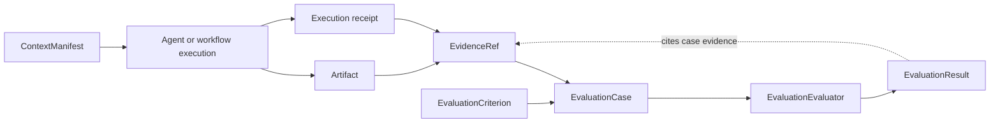

# Evaluation

Evaluation binds judgements to explicit criteria and recorded evidence.
`EvaluationCase` contains a stable case identifier, weighted criteria, and the
only evidence evaluators may cite.

<<< @/snippets/v2/evaluation-composition.ts

`createEvaluationComposition` validates evaluator descriptors, orders
evaluators deterministically, and stamps every result with the registered
evaluator identity and case identity. A judgement can report `pass`, `fail`, or
`inconclusive`.

Scores refer only to criteria declared by the case. Result evidence must be
drawn from that case, so an evaluator cannot quietly introduce an unrecorded
source. Synchronous compositions remain synchronous; the result becomes
asynchronous only when an evaluator does.

Evaluation is provider-neutral. A model-based judge can be supplied as an
evaluator, but its provider client and prompts remain live implementation
details.
