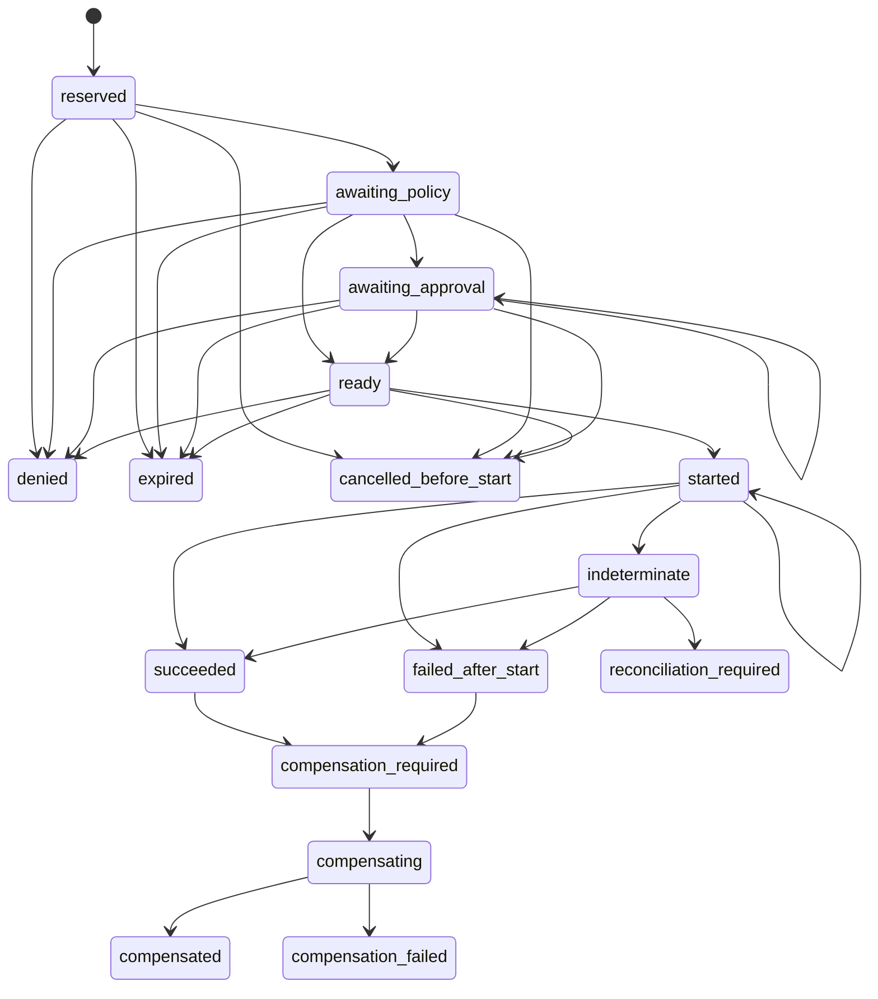

# Evidence

Evidence records what controlled execution established without coupling the
contract to a database or telemetry vendor. `/evidence` exports redacted
`ToolExecutionEvent` values, an `EventSink`, and the `ToolReceiptJournal` port.

<<< @/snippets/v2/evidence-redaction.ts

`ToolExecutionEvent` describes the controlled tool-execution lifecycle. It is
not an `AgentEvent`, an `InteractionEvent`, or a general tracing event. Keeping
these families separate prevents one lifecycle from being interpreted as
another.

## Receipts are authoritative

A `ToolExecutionReceipt` binds an idempotency key, action digest, policy
decision, approval, transitions, and final effect disposition. The journal is
a storage-neutral port with explicit reserve, append, load, and lookup
operations. Your adapter supplies atomic persistence.

Events are projections of the durable execution record. They are useful for
observation, but replaying an event sink does not substitute for receipt
recovery.

## Receipt recovery lifecycle

Denied, expired, and cancelled-before-start are terminal branches before
`started`. An indeterminate receipt may be reconciled to succeeded or
failed-after-start when authoritative evidence becomes available.

Receipt state and effect disposition answer different questions:

| Effect disposition | Meaning                                              |
| ------------------ | ---------------------------------------------------- |
| `not-started`      | Execution did not cross the durable started boundary |
| `none`             | The operation completed without a meaningful effect  |
| `applied`          | The intended effect is known to have applied         |
| `partial`          | Only part of the intended effect applied             |
| `unknown`          | The effect cannot yet be established                 |
| `compensated`      | A recorded compensation completed                    |

The receipt snapshot is append-derived. Recovery loads its ordered durable
history; it does not infer state from best-effort events.

## Redaction happens before emission

`redactedNativeExtensions` accepts strict JSON only after sensitive provider
values have been removed or replaced. Namespaced extensions preserve safe
native detail without exposing credentials, raw headers, signed URLs, or
provider objects.

An `EvidenceRef` identifies evidence held behind authorized storage. It carries
integrity metadata, not a locator or permission to disclose the content.
