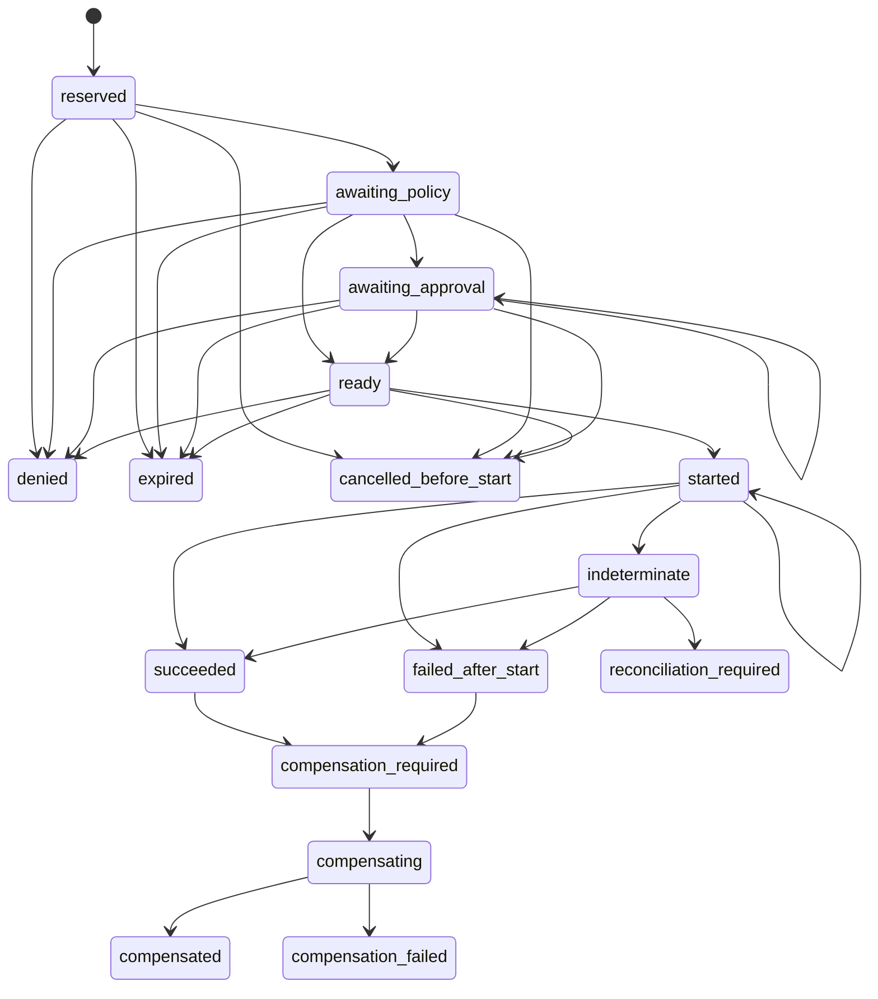

# Evidence

Evidence records what controlled execution established without coupling the contract to a database or telemetry vendor. `/evidence` exports redacted `ToolExecutionEvent` values, an `EventSink`, and the `ToolReceiptJournal` port.

<<< @/snippets/v2/evidence-redaction.ts

`ToolExecutionEvent` describes the controlled tool-execution lifecycle. It is not an `AgentEvent`, an `InteractionEvent`, or a general tracing event. Keeping these families separate prevents one lifecycle from being interpreted as another.

## Receipts are authoritative

A `ToolExecutionReceipt` binds an idempotency key, action digest, policy decision, approval, transitions, and final effect disposition. The journal is a storage-neutral port with explicit reserve, append, load, and lookup operations. Your adapter supplies atomic persistence.

Events are projections of the durable execution record. They are useful for observation, but replaying an event sink does not substitute for receipt recovery.

## Receipt recovery lifecycle

Denied, expired, and cancelled-before-start are terminal branches before `started`. An indeterminate receipt may be reconciled to succeeded or failed-after-start when authoritative evidence becomes available.

Receipt state and effect disposition answer different questions:

| Effect disposition | Meaning                                              |
| ------------------ | ---------------------------------------------------- |
| `not-started`      | Execution did not cross the durable started boundary |
| `none`             | The operation completed without a meaningful effect  |
| `applied`          | The intended effect is known to have applied         |
| `partial`          | Only part of the intended effect applied             |
| `unknown`          | The effect cannot yet be established                 |
| `compensated`      | A recorded compensation completed                    |

The receipt snapshot is append-derived. Recovery loads its ordered durable history; it does not infer state from best-effort events.

## Redaction happens before emission

`redactedNativeExtensions` accepts strict JSON only after sensitive provider values have been removed or replaced. Namespaced extensions preserve safe native detail without exposing credentials, raw headers, signed URLs, or provider objects.

An `EvidenceRef` identifies evidence held behind authorized storage. It carries integrity metadata, not a locator or permission to disclose the content.

## Model usage is an observed receipt

`createUsageReceipt` snapshots observed provider or adapter token usage against the exact invocation and resolved model/profile identity. It can record a provider request ID when one is available, but it accepts neither a native response object nor provider credentials. The receipt makes attribution explicit: it is attributed, partially attributed with named missing metrics, or unavailable with a bounded reason. `attributed` requires every portable usage metric; `partial.missing` must name exactly the metrics the receipt does not contain, so a provider response cannot overstate its coverage.

For a completed portable `ModelResponse`, `createObservedModelUsageReceipt` derives that identity from `model.profile`, records the response's observed usage and request ID, and drops its content, warnings, errors, and native metadata. A response without usage becomes an explicit `not-reported` attribution rather than an inferred zero.

The receipt always carries an explicit pricing disposition. This capability records only `unavailable` pricing (`not-provided`, `stale`, or `unverified-source`), so it cannot accidentally create a cost claim. A later cost-intelligence capability may add versioned pricing, currency, estimate, and provider-reconciliation facts; it must not reinterpret a usage receipt as any of those facts.

Downstream products may correlate receipts with project or work records through stable identities. Correlation does not assign those semantics to the receipt. In particular, a provider receipt does not establish that repository work was accepted, that an intervention caused an outcome, or that a comparison window is admissible. Those conclusions remain with the consuming product and must be withheld when its evidence is insufficient.

This boundary is also what permits an independent-executor proof. A native or external executor records what it attempted and what it observed. It cannot mark its own work accepted, redefine the authorised Project intent or turn a provider success state into an improved delivery, product or business outcome. The consuming composition must join separately owned evidence and may return an unavailable or inconclusive result.

`createBudgetDecisionEvidence` records a composition-owned allow, warn, stop, or overrun decision for a known invocation and budget limit. It is evidence of the decision, not a budget controller and not a rewrite of observed usage.

## Observability is a one-way projection

The internal OpenTelemetry projection adapter accepts a canonical `ToolExecutionEvent`, projects a fixed safe subset of its facts, and schedules one best-effort span or log export. It declares its sampling, redaction, delivery, and retention behavior. Native extensions, authorized evidence references, action digests, provider request metadata, and credentials are never projected.

An exporter failure is ignored after scheduling and is never retried by the adapter. It cannot acknowledge, gate, or replay a model or tool effect. Trace context only correlates the projection with an external trace; the canonical event and receipt remain the source of truth.
