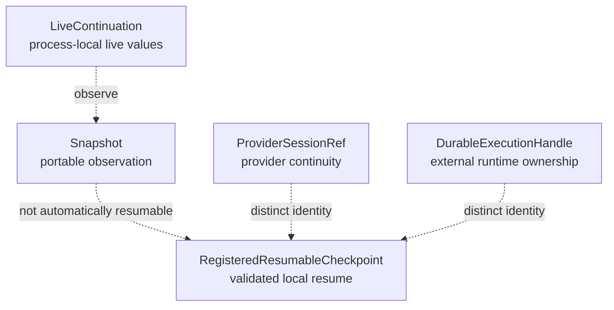

# State and durability

The `/state` contracts distinguish five lifetimes. Choosing the correct one
prevents a convenient local value from being mistaken for durable resume data.

| Lifetime                        | Guarantee                                                           |
| ------------------------------- | ------------------------------------------------------------------- |
| `LiveContinuation`              | Retains process-local values and deliberately rejects serialization |
| `Snapshot`                      | Captures a portable point-in-time observation                       |
| `RegisteredResumableCheckpoint` | Passed checkpoint registration and can enter local resume           |
| `ProviderSessionRef`            | Identifies opaque provider conversation continuity                  |
| `DurableExecutionHandle`        | Identifies work owned by an external durable runtime                |

<<< @/snippets/v2/state-lifetimes.ts

Only a registered checkpoint enters local checkpoint resume. Registration
validates and freezes portable state plus runtime, contract schema, code,
checkpoint format, native-reference, and recorded-effect compatibility.

`checkResumeCompatibility` compares those recorded facts with the current
runtime. A provider session and durable execution handle remain explicit
alternatives; neither can masquerade as a local checkpoint.
