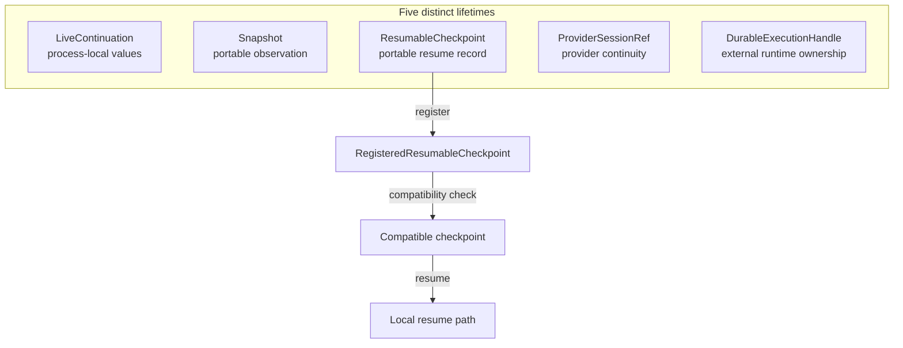

# State and durability

The `/state` contracts distinguish five sibling lifetimes. Choosing the correct one
prevents a convenient local value from being mistaken for durable resume data.

| Lifetime                 | Guarantee                                                           |
| ------------------------ | ------------------------------------------------------------------- |
| `LiveContinuation`       | Retains process-local values and deliberately rejects serialization |
| `Snapshot`               | Captures a portable point-in-time observation                       |
| `ResumableCheckpoint`    | Portable resume record that has not yet passed local registration   |
| `ProviderSessionRef`     | Identifies opaque provider conversation continuity                  |
| `DurableExecutionHandle` | Identifies work owned by an external durable runtime                |

<<< @/snippets/v2/state-lifetimes.ts

`RegisteredResumableCheckpoint` is a refinement of `ResumableCheckpoint`, not a
sixth lifetime. Only that refinement enters local checkpoint resume. Registration
validates and freezes portable state plus runtime, contract schema, code,
checkpoint format, native-reference, and recorded-effect compatibility.

`checkResumeCompatibility` compares those recorded facts with the current
runtime. Snapshots, provider sessions, and durable execution handles remain
non-substitutable siblings; none converts into a checkpoint.
