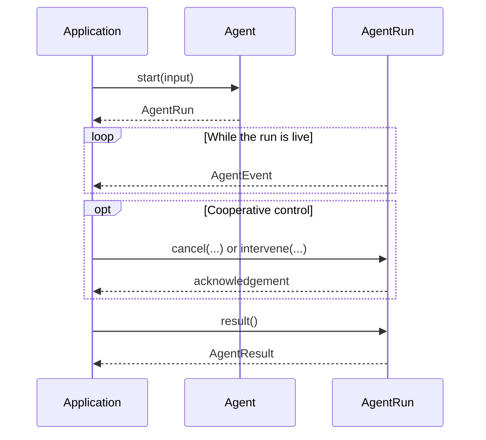

# Run an agent

Create an `Agent` from a model, instructions, and optional tools. The common
facade owns preparation, invocation identity, and the local run lifecycle.

## The common path

<<< @/snippets/v2/local-agent.ts

`createAgent` returns a ready `Agent`:

- `agent.run(input)` returns one `AgentResult`;
- `agent.start(input)` returns a live `AgentRun`;
- `AgentRun.events()` streams ordered `AgentEvent` values; and
- `AgentRun.result()` returns the same terminal result exactly once.

The common path accepts read-only `Tool` values created by `defineTool`.
Meaningful effects fail closed because they require explicit controlled runtime
composition.

`AgentEvent` reports agent lifecycle facts such as start, progress,
intervention, cancellation, and terminal status. It is not a
`ToolExecutionEvent`, which is the redacted evidence projection for controlled
tool execution.

## Handle the result

`AgentResult` has one terminal status:

| Status      | Meaning                                              |
| ----------- | ---------------------------------------------------- |
| `completed` | The runtime completed the agent run.                 |
| `failed`    | Execution failed without reporting success.          |
| `denied`    | Required authority or policy did not permit the run. |
| `cancelled` | The live run reached terminal cancellation.          |

A cancellation acknowledgement is not the terminal result. Continue consuming
the lifecycle and read `result()` for final status.

## Implement or select a runtime

Most applications do not need this layer. Runtime and adapter authors import
from `@geekist/llm-core/agent/runtime`.

<<< @/snippets/v2/model-tool-agent.ts

The extension vocabulary is deliberately explicit:

| Contract                  | Responsibility                                                     |
| ------------------------- | ------------------------------------------------------------------ |
| `AgentDefinition`         | Portable authored identity, instructions, requirements, and skills |
| `PreparedAgentDefinition` | Definition prepared and provenanced by one compatible runner       |
| `AgentRunner`             | Runtime port that prepares definitions and starts or resumes runs  |
| `AgentRunnerProfile`      | Supported runtime behavior and optional controls                   |
| `AgentStartRequest`       | Prepared definition, invocation context, and portable input        |

`createLocalAgentRunner` and `createModelToolAgentProgram` remain runtime
constructors. Read-only `ExecutableTool` values can execute directly. Every
other effect class requires controlled execution; if that route is absent, the
program returns a safe failure instead of bypassing policy, approval, or
receipts.

Optional behavior remains profile-gated. Local intervention support also
requires an `InterventionAuthenticationPort`; the runner accepts a decision
only while its matching request remains pending and authenticated.

Next, [build and resume a workflow](/guide/workflow) or review
[capability contracts](/capabilities/).
