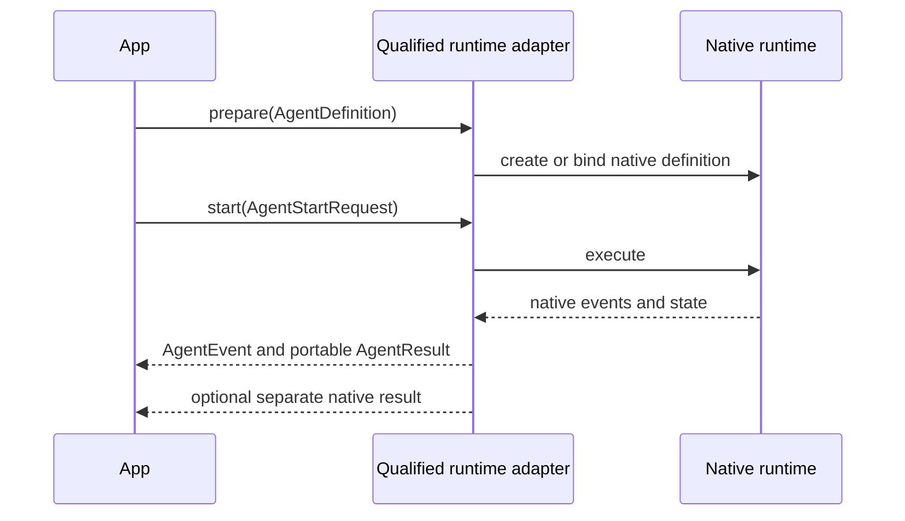

# Agents and runtime integrations

`AgentDefinition`, `AgentEvent`, and `AgentResult` are portable contracts. `AgentRunner` is the extension port implemented by a concrete runtime adapter. The package does not provide a default or fallback runner.

<<< @/snippets/v2/agent-capabilities.ts

## Portable results

`AgentResult.output` is a closed kernel-owned union. Text results use `{ kind: "text", text: string }`; structured portable results use `{ kind: "json", value: JsonValue }`. Runtime names, native messages, tool records, provider state, and undeclared fields cannot cross this surface.

A qualified adapter may expose a separate integration-owned result operation. For example, `PydanticAiAgentRun.nativeResult()` returns the exact assessed PydanticAI observation through a separate operation. The adapter correlates that response to the run handle and its cached portable terminal text before returning it. Consumers that only use `AgentRunner` remain runtime-independent.

## Runner lifecycle

A runner declares capabilities, prepares a definition, starts a run, and may optionally resume a compatible native checkpoint. The resulting `AgentRun` normalizes lifecycle events and terminal status while preserving native state as opaque references.

The adapter declares exact operations. A portable normalised lifecycle may be supported without claiming support for the runtime's native event stream. Native sessions, graphs, checkpoints, dependencies, provider state, workspaces, and trajectories remain owned by the selected runtime and must be preserved through its explicit native surface or declared `unsupported`. Qualified portable preparation and start paths first register detached strict JSON snapshots, then validate and transport only those snapshots. Callers cannot use accessors to create validation/use divergence.

`not-applicable` is reserved for an operation or semantic dimension absent from the pinned source contract. Missing implementation, failed qualification, or version drift is `unsupported`.

The former `createAgent` and `createLocalAgentRunner` public paths were removed by ADR-016. The local TypeScript runner remains private conformance evidence.
