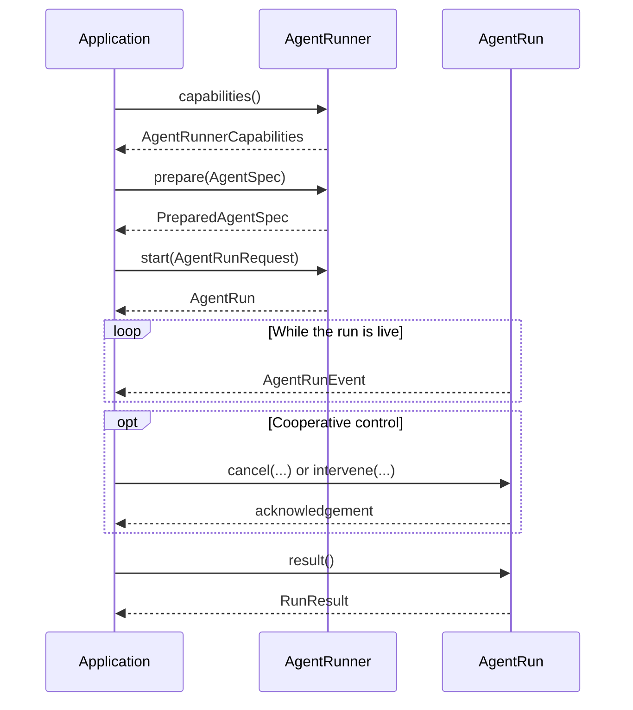

# Run an agent

An agent starts as portable intent and becomes executable only after a runner
prepares it. The runner owns the live lifecycle from capability discovery
through the terminal result.

## The complete local run

The first checked example keeps composition deliberately small. Its program
echoes the input and declares read-only behavior.

<<< @/snippets/v2/local-agent.ts

The three phases matter:

1. `prepareAgentSpec` validates and freezes portable authoring data.
2. `createLocalAgentRunner` receives live identity and execution ports.
3. `runner.prepare()` binds the spec to that runner before `runner.start()`
   creates an `AgentRun`.

A spec prepared for one runner is not transferable proof that another runner
can execute it. Every selected runner prepares the spec for itself.

## Build the model and tool program

`createModelToolAgentProgram` is the intended bridge from a neutral `Model` and
registered `ToolBinding` values into `createLocalAgentRunner`. It owns the model
loop, tool-call handling, optional conversation persistence, child-agent
dispatch, model-call budgets, and portable termination.

<<< @/snippets/v2/model-tool-agent.ts

Read-only tools can execute directly through their binding. Every other effect
class requires both a composed controlled-execution port and a
`controlledToolInput` mapper. If either is missing, the program returns a safe
tool failure instead of bypassing policy, approval, or receipts.

The invocation budget and `maxModelCalls` both apply; the smaller limit wins.
Conversation persistence accepts portable content only and rejects inline
binary data rather than silently dropping it.

## Read the lifecycle

`AgentRun.events()` yields ordered `AgentRunEvent` values. These events report
agent lifecycle facts such as start, progress, intervention, cancellation, and
terminal status.

They are not `ExecutionEvent` values. `ExecutionEvent` belongs to the redacted
evidence model for controlled tool execution. An application may correlate the
two event families by their identities, but it should not treat them as one
union.

## Handle the terminal result

`AgentRun.result()` resolves exactly once to a `RunResult`:

| Status      | Meaning                                              |
| ----------- | ---------------------------------------------------- |
| `completed` | The runner completed the agent run.                  |
| `failed`    | Execution failed without reporting success.          |
| `denied`    | Required authority or policy did not permit the run. |
| `cancelled` | The live run reached terminal cancellation.          |

A cancellation acknowledgement is not the terminal result. It reports whether
the runner accepted, had already completed, or does not support the request.
Continue consuming the lifecycle and read `result()` for the final status.

## Check capabilities before optional controls

`AgentRunner.capabilities()` states whether a runner supports controlled
effects, cooperative cancellation, interventions, checkpoint resume, provider
session continuation, durable execution signalling, and child runs.

Optional behavior remains capability-gated. In particular, a controlled agent
must be composed with the controlled tool-execution port. If that guarantee is
absent, preparation fails closed.

Next, [build and resume a workflow](/guide/workflow) or review
[capability contracts](/capabilities/).
