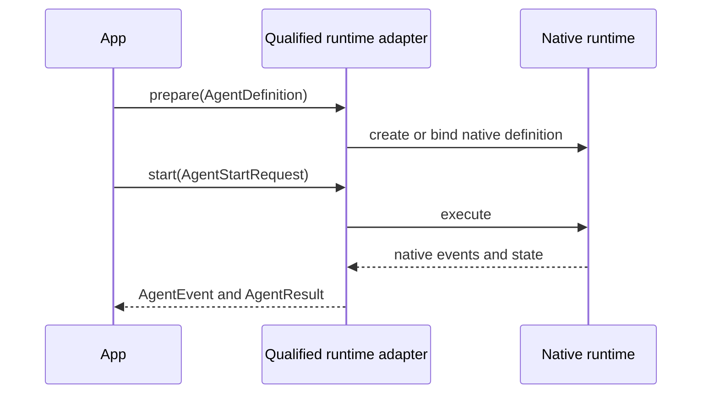

# Agents and runtime integrations

`AgentDefinition`, `AgentEvent`, and `AgentResult` are portable contracts.
`AgentRunner` is the extension port implemented by a concrete runtime adapter.
The package does not provide a default or fallback runner.

<<< @/snippets/v2/agent-capabilities.ts

## Runner lifecycle

A runner declares capabilities, prepares a definition, starts a run, and may
optionally resume a compatible native checkpoint. The resulting `AgentRun`
normalizes lifecycle events and terminal status while preserving native state
as opaque references.

The adapter must report unsupported controls and semantic loss. It must not
discard native sessions, graphs, checkpoints, workspaces, or trajectories to
make runtimes appear interchangeable.

The former `createAgent` and `createLocalAgentRunner` public paths were removed
by ADR-016. The local TypeScript runner remains private conformance evidence.
