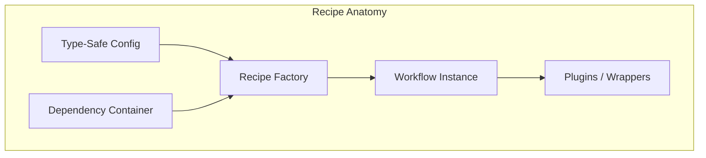
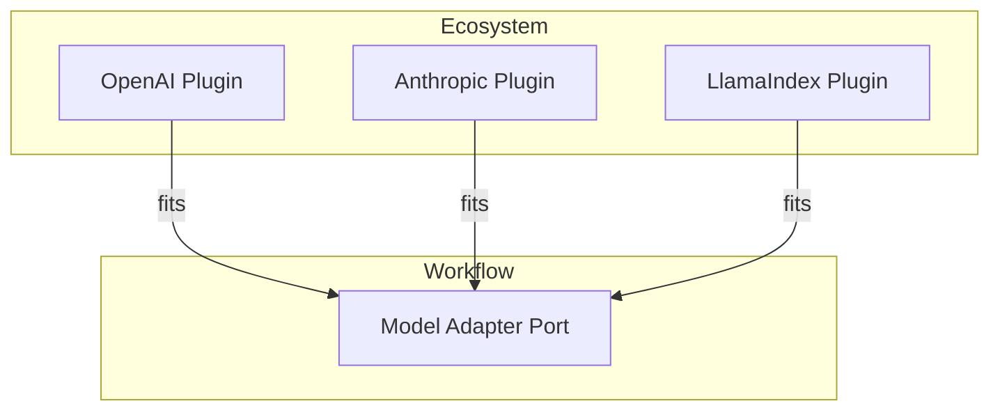

# Core Concepts

Four ideas shape how `llm-core` behaves:

1. **Recipes are assets.**
2. **Adapters are plugs.**
3. **Interactions are projections.**
4. **Steps are uniform.**

Each idea keeps the system predictable while staying flexible enough for real applications.

## 1. Principle: Recipes are Assets

A **Recipe** is more than a script. It is a named, versioned composition of steps. Internally, recipe authors group steps into **Packs** for reuse and override control.



Recipes describe _what_ you want to happen. Packs supply the individual steps that implement that intent. Most users only touch `recipes.*()` and never need to author packs directly.

- Packs contain **Steps**, which are the actual units of work (internal authoring tool).
- Recipes stitch Packs together. You call `recipes.*()` to build them.
  See [Composition Model](/reference/composition-model) for the internal wiring.

### Sidebar: The Engine, called a Workflow

You write code in terms of **Recipes**, and you run that code through a **Workflow**.

`Workflow` behaves like a compiler and a runtime in one place. It takes the high-level recipe
and turns it into a directed acyclic graph (DAG) of executable steps, then runs that graph with
tracing and state management.

```js
// 1. Authoring: declarative recipe
import { recipes } from "@geekist/llm-core/recipes";

const agent = recipes.agent();

// 2. Compiling: infrastructure
const app = agent.build();

// 3. Execution: runtime
await app.run({ input: "Do work" });
```

This separation keeps your logic portable. The Recipe captures intent in a type-safe way.
The Workflow handles execution, state, retries, and trace collection.

## 2. Principle: Adapters are Plugs

Adapters can feel abstract at first, so treat them as a simple electrical model.

- **Adapters** act as **ports** with a standard shape, such as a model port or a vector store port.
- **Plugins** act as the **appliances** that plug into those ports.



You define the Adapter port by saying "this recipe needs a Model". Then you choose a Plugin,
for example "use OpenAI" or "use Anthropic" or "use LlamaIndex".

Because the port has a stable contract, you can change provider, region, or underlying client
and keep the rest of the recipe intact. This is what makes `llm-core` interoperate cleanly with
other ecosystems such as AI SDK, LangChain, and LlamaIndex.

## 3. Principle: Interactions are Projections

Recipes drive full workflows. Interactions focus on a single turn and reshape model output into
UI-friendly state.

An Interaction receives model or retrieval streams and **projects** them into an `InteractionState`.
That state can power a chat window, a task panel, or another interactive surface.

Interaction-related pieces fall into three parts:

- **Interaction Core** turns an `InteractionEvent` stream into `InteractionState`.
- **Sessions** add storage and policy, which lets you persist state across turns or users.
- **UI SDK adapters** live outside core and convert events into UI-specific streams or commands.

This structure makes it possible to build chat UIs, inspectors, or dashboards in environments
that do not use the workflow runtime directly.

```js
import {
  createInteractionPipelineWithDefaults,
  runInteractionPipeline,
} from "@geekist/llm-core/interaction";

const pipeline = createInteractionPipelineWithDefaults();
const result = await runInteractionPipeline(pipeline, {
  input: { message: { role: "user", content: "Hello!" } },
});

console.log(result.artefact.messages);
```

Learn more in:

- [Interaction Core](/interaction/)
- [Interaction Sessions](/interaction/session)
- [UI SDK Adapters](/adapters/ui-sdk)

## 4. Principle: Steps are Uniform and use MaybePromise

In `llm-core`, every execution step follows the same shape and accepts both synchronous and
asynchronous work.

The guiding rule is simple: business logic reads as synchronous code, and the runtime takes care of waiting.

- Input can return a plain value `T` or a `Promise<T>`.
- The runtime decides when to await and how to compose results.
- You write small, focused functions, and they slot into pipelines without ceremony.

```js
// This step is synchronous
const ValidationStep = (_, { input }) => {
  if (input.length > 100) {
    return { error: "Too long" };
  }
};

// This step is asynchronous
const DatabaseStep = async (_, { input }) => {
  await db.save(input);
};

// The framework runs both through the same composition model.
```

This approach helps you avoid the usual "function colouring" problems where asynchronous code
spreads through an entire codebase. You can keep most utilities simple and only add `async`
behaviour where it earns its place.

## The Outcome and error handling

Asynchronous workflows become easier to debug when failure lives in data instead of control flow.
`llm-core` represents execution results through an **Outcome** object.

An Outcome has three possible states:

| Status   | Meaning             | What you receive             |
| :------- | :------------------ | :--------------------------- |
| `ok`     | Run completed       | The full `artefact`          |
| `paused` | Waiting on a signal | A `token` to resume later    |
| `error`  | Run failed          | The `error` and partial logs |

### Why "Paused" exists

Agentic systems often need to stop and wait for a person, a tool result, or another service.
If this interruption happened through an exception, intermediate state would be hard to recover.

The `paused` state keeps the state tree and a token in a structured form. You can store the token
in a database, send a notification, and resume the workflow later.

```js
const result = await workflow.run({ input: "..." });

if (result.status === "paused") {
  await db.save(result.token);
}
```

## Key ideas to carry forward

Recipes describe intent and assemble Packs into portable assets.
Adapters describe capabilities and allow provider choice without rewriting the recipe.
Interactions reshape model output into state that user interfaces can render and store.
Steps provide the smallest units of work and always follow the same MaybePromise shape.
Outcomes tell you whether a run completed, paused, or failed, and they preserve trace data
for later inspection.

These pieces work together so you can move from a small recipe to a production workflow
while keeping a clear mental model of what the system is doing at each stage.
