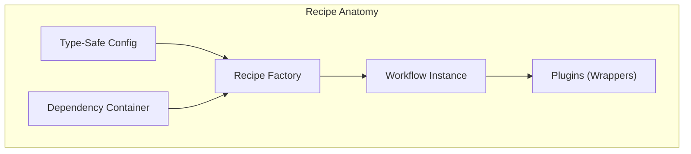
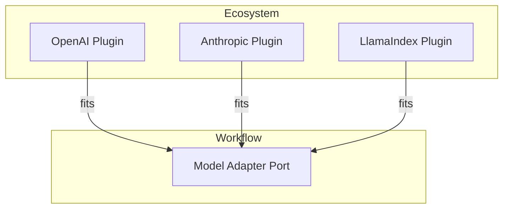

# Core Concepts

There are three principles that make `llm-core` predictable:

1.  **Recipes** are Assets.
2.  **Adapters** are Plugs.
3.  **Steps** are Uniform.

## 1. Principle: Recipes are Assets

A **Recipe** is not just a script. It is a named, versioned composition of **Packs**.
Think of a Pack as a "module of logic" that you can test in isolation.



- **Packs** contain **Steps** (the actual logic).
- **Recipes** stitch Packs together internally. You use `recipes.*()` to build them.

### Sidebar: The Engine (Workflow)

You author with **Recipes**, but you execute with **Workflow**.
Think of `Workflow` as the compiler and runtime. It takes your high-level recipe and turns it into a directed acyclic graph (DAG) of executable steps.

```ts
// 1. Authoring (Declarative)
import { recipes } from "@geekist/llm-core/recipes";

const agent = recipes.agent(); // typed recipe handle

// 2. Compiling (Infrastructure)
const app = agent.build(); // runnable workflow

// 3. Execution (Runtime)
await app.run({ input: "Do work" });
```

== JavaScript

```js
// 1. Authoring (Declarative)
import { recipes } from "@geekist/llm-core/recipes";

const agent = recipes.agent();

// 2. Compiling (Infrastructure)
const app = agent.build();

// 3. Execution (Runtime)
await app.run({ input: "Do work" });
```

This separation is why your logic is portable. The Recipe describes the intent; the Workflow handles the execution, state management, and tracing.

## 2. Principle: Adapters are Plugs

This is the most common point of confusion. Here's the mental model:

- **Adapters** are the **ports** (Standard shape).
- **Plugins** are the **appliances** (Implementation).



You define the **Adapter Port** ("I need a Model"). You choose the **Plugin** ("Use OpenAI").
Because the port is standard, you can swap the appliance without rewiring the house.

## 3. Principle: Steps are Uniform (MaybePromise)

In `llm-core`, every execution step has the same shape. Functions can be sync or async transparently.

**The Rule**: Business logic should look synchronous unless it _needs_ to wait.

- **Input**: You can return `T` OR `Promise<T>`.
- **Execution**: The runtime handles the `await`.
- **Benefit**: You write plain functions. This prevents "function coloring" issues where async logic poisons standard utilities.

::: tabs
== TypeScript

```ts
type StepApply = (_: unknown, options: { input: string }) => unknown;

// This step is sync
const ValidationStep: StepApply = (_, { input }) => {
  if (input.length > 100) return { error: "Too long" };
};

// This step is async
const DatabaseStep: StepApply = async (_, { input }) => {
  await db.save(input);
};

// The framework runs both without you changing how you compose them.
```

== JavaScript

```js
// This step is sync
const ValidationStep = (_, { input }) => {
  if (input.length > 100) return { error: "Too long" };
};

// This step is async
const DatabaseStep = async (_, { input }) => {
  await db.save(input);
};

// The framework runs both without you changing how you compose them.
```

:::

## The Outcome (No Throws)

We favor explicit failure states over `try/catch` blocks in async workflows. This ensures tracing remains intact.
Instead, every run returns an **Outcome** object.

It has three states:

| Status   | Meaning           | What you get                 |
| :------- | :---------------- | :--------------------------- |
| `ok`     | Success!          | The complete `artefact`      |
| `paused` | Waiting for Human | A `token` to resume later    |
| `error`  | Something broke   | The `error` and partial logs |

### Why "Paused"?

AI agents often need to stop and ask for permission.
If code threw an error, you'd lose the state.
With `paused`, we serialize the state so you can resume execution hours (or days) later.

::: tabs
== TypeScript

```ts
const result = await workflow.run({ input: "..." });

if (result.status === "paused") {
  const token: unknown = result.token;
  // Save token to DB, email the user
  await db.save(result.token);
}
```

== JavaScript

```js
const result = await workflow.run({ input: "..." });

if (result.status === "paused") {
  // Save token to DB, email the user
  await db.save(result.token);
}
```

:::

## Key Takeaways

- [ ] **Recipes** are the Logic (Brain). They are portable assets.
- [ ] **Adapters** are the Capabilities (Hands). They plug into specific providers.
- [ ] **Steps** are the atomic units of execution.
- [ ] **Outcome** is the typed result, which can be `ok`, `error`, or `paused`.
