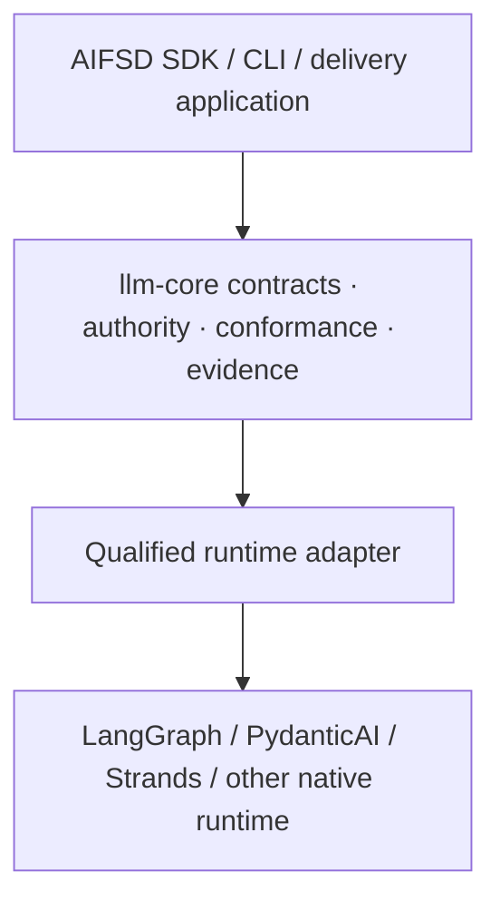

# Core concepts

## Two complete use cases

**AI-first software delivery** covers understanding a request and repository, accepted specification, coding-agent work, tests, independent review, evaluation, approval, evidence, and release decision.

**Agentic product runtime** covers models, tools, context, workflows, human decisions, policy, telemetry, and outcomes inside the delivered software.

`llm-core` owns the stable contracts between those use cases. AIFSD composes those contracts into products and host plans. A qualified runtime adapter executes them through its native framework.

## Ownership

```mermaid
flowchart TB
  Delivery["AIFSD SDK / CLI / delivery application"]
  Kernel["llm-core contracts · authority · conformance · evidence"]
  Runtime["Qualified runtime adapter"]
  Native["LangGraph / PydanticAI / Strands / other native runtime"]

  Delivery --> Kernel
  Kernel --> Runtime
  Runtime --> Native
```

The kernel does not own an agent loop, workflow engine, conversation executor, scheduler, or durable worker fleet.

## Explicit extension boundaries

- `AgentDefinition` describes portable agent intent.
- `AgentRunner` is the port implemented by a runtime integration.
- `CompiledSpecification<T>` binds a projected value to reviewed authority.
- native values remain native behind explicit integration-owned surfaces.
- specification adapters declare a closed matrix of all five exact operations as `supported`, `unsupported`, or `not-applicable`; every entry binds the declaration's recognised source contract exactly, and supported entries carry immutable fixtures.
- normalized events and evidence enable comparison without claiming identical behavior.

See [API by subpath](/reference/api) for the package surface.
