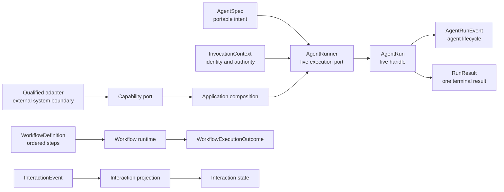
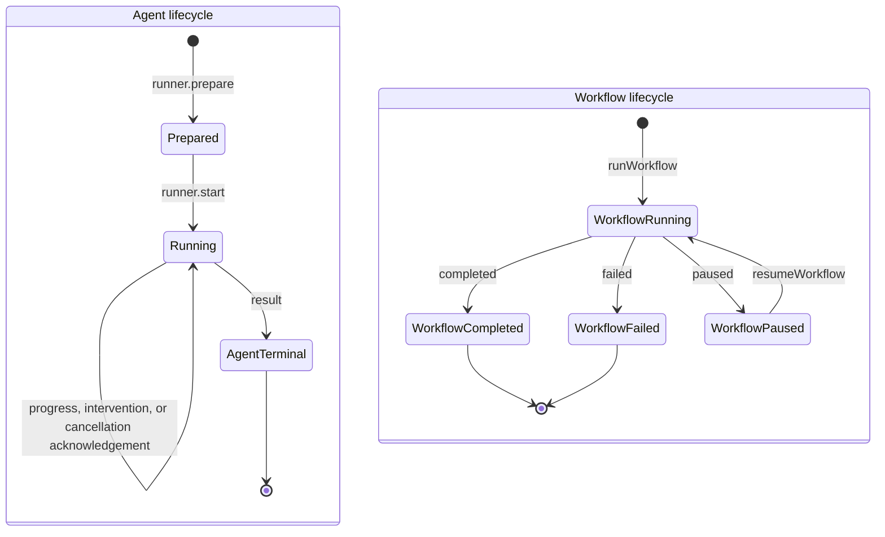

# Core concepts

`llm-core` separates portable descriptions from live execution. That boundary
keeps authority, state, and provider integration visible as an application
grows.

## Portable contracts, live ports

An `AgentSpec` is portable data. It contains identity, version, instructions,
an effect requirement, metadata, and skill references. It does not contain
provider clients, credentials, or open connections.

An `AgentRunner` is a live port. It declares its capabilities, prepares a spec
for its own execution environment, and starts an `AgentRun`. It may resume one
when checkpoint resume is supported.
`InvocationContext` carries portable identity and authority separately from
those live dependencies.

The same boundary appears across the package. Capabilities define stable
contracts. Qualified adapters translate external systems into those contracts.
Application code decides which implementations to compose.

```mermaid
flowchart LR
    Spec["AgentSpec<br/>portable intent"] --> Runner["AgentRunner<br/>live execution port"]
    Context["InvocationContext<br/>identity and authority"] --> Runner
    Adapter["Qualified adapter<br/>external system boundary"] --> Port["Capability port"]
    Port --> Composition["Application composition"]
    Composition --> Runner
    Runner --> Run["AgentRun<br/>live handle"]
    Run --> AgentEvents["AgentRunEvent<br/>agent lifecycle"]
    Run --> Result["RunResult<br/>one terminal result"]

    Definition["WorkflowDefinition<br/>ordered steps"] --> Runtime["Workflow runtime"]
    Runtime --> Outcome["WorkflowExecutionOutcome"]

    Canonical["InteractionEvent"] --> Projection["Interaction projection"]
    Projection --> State["Interaction state"]
```

## Agents and workflows are different execution models

An agent loop is probabilistic. The runner controls its live lifecycle, while
the model may choose the next action within the prepared spec and available
capabilities.

A workflow is author-defined orchestration. Its ordered steps, retry behavior,
pause points, and rollback behavior are explicit in a `WorkflowDefinition`.

Keeping the models separate gives each one an honest result:

| Lifecycle   | Live or returned value     | Outcome shape                                                |
| ----------- | -------------------------- | ------------------------------------------------------------ |
| Agent       | `AgentRun`                 | `RunResult`: `completed`, `failed`, `denied`, or `cancelled` |
| Workflow    | `WorkflowExecutionOutcome` | `completed`, `paused`, or `failed`                           |
| Interaction | `InteractionProjection`    | Deterministic state reduced from `InteractionEvent` values   |

```mermaid
stateDiagram-v2
    state "Agent lifecycle" as agent {
        [*] --> Prepared: runner.prepare
        Prepared --> Running: runner.start
        Running --> Running: progress, intervention, or cancellation acknowledgement
        Running --> AgentTerminal: result
        AgentTerminal --> [*]
    }

    state "Workflow lifecycle" as workflow {
        [*] --> WorkflowRunning: runWorkflow
        WorkflowRunning --> WorkflowCompleted: completed
        WorkflowRunning --> WorkflowFailed: failed
        WorkflowRunning --> WorkflowPaused: paused
        WorkflowPaused --> WorkflowRunning: resumeWorkflow
        WorkflowCompleted --> [*]
        WorkflowFailed --> [*]
    }
```

An ephemeral `WorkflowPauseSnapshot` resumes the general passive workflow
runtime. It is not a durable checkpoint. Durable, authenticated resume uses a
registered checkpoint and the controlled intervention workflow.

## Event families stay distinct

The package uses several closed event families because they answer different
questions:

- `AgentRunEvent` reports the lifecycle of one live agent run.
- `ExecutionEvent` projects redacted evidence for controlled tool execution.
- `InteractionEvent` is reduced into deterministic interaction state.

An `AgentRunEvent` is not an `ExecutionEvent`. Controlled tool use may produce
both agent lifecycle events and execution evidence, but one does not substitute
for the other.

Provider-native metadata enters portable evidence or interaction state only
through validated, namespaced, redacted extensions. Credentials, live clients,
raw tool arguments, and raw tool results do not belong in those projections.

## Meaningful effects fail closed

Tool policy evaluates an action. Approval records a decision. Execution invokes
the bound tool. A receipt records durable evidence. None of these stages grants
the authority of another stage.

If the controlled path cannot verify its binding, authority, or durable receipt
transition, it does not execute or blindly replay a meaningful effect. This is
especially important after interruption, when an effect may have started even
though its completion was not observed.

Continue with [Run an agent](/guide/agent),
[Build and resume a workflow](/guide/workflow), or
[Project an interaction](/interaction/).
