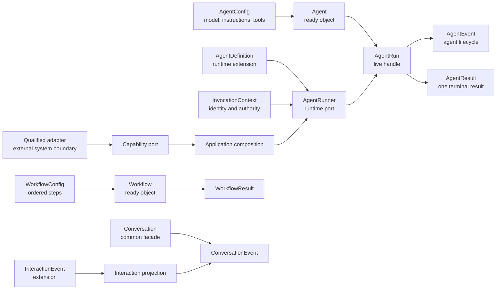
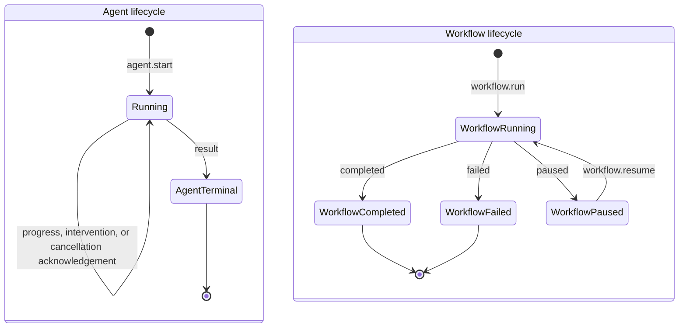

# Core concepts

`llm-core` separates portable descriptions from live execution. That boundary
keeps authority, state, and provider integration visible as an application
grows.

## Ready objects, explicit extensions

`createAgent` accepts a model, instructions, and optional tools and returns a
ready `Agent`. Calling `run` returns one `AgentResult`; calling `start` returns
an `AgentRun` whose events and controls remain live.

Runtime implementers use `/agent/runtime`. `AgentDefinition` is portable data;
`AgentRunner` prepares it for one runtime and starts an `AgentRun`.
`InvocationContext` carries identity and authority separately from live
dependencies.

The same boundary appears across the package. Capabilities define stable
contracts. Qualified adapters translate external systems into those contracts.
Application code decides which implementations to compose.

```mermaid
flowchart LR
    AgentConfig["AgentConfig<br/>model, instructions, tools"] --> Agent["Agent<br/>ready object"]
    Agent --> Run["AgentRun<br/>live handle"]
    Run --> AgentEvents["AgentEvent<br/>agent lifecycle"]
    Run --> Result["AgentResult<br/>one terminal result"]

    Definition["AgentDefinition<br/>runtime extension"] --> Runner["AgentRunner<br/>runtime port"]
    Context["InvocationContext<br/>identity and authority"] --> Runner
    Adapter["Qualified adapter<br/>external system boundary"] --> Port["Capability port"]
    Port --> Composition["Application composition"]
    Composition --> Runner
    Runner --> Run

    Config["WorkflowConfig<br/>ordered steps"] --> Workflow["Workflow<br/>ready object"]
    Workflow --> Outcome["WorkflowResult"]

    Conversation["Conversation<br/>common facade"] --> ConversationEvent["ConversationEvent"]
    Canonical["InteractionEvent<br/>extension"] --> Projection["Interaction projection"]
    Projection --> ConversationEvent
```

## Agents and workflows are different execution models

An agent loop is probabilistic. Its runtime controls the live lifecycle, while
the model may choose the next action within the configured instructions and
available tools.

A workflow is author-defined orchestration. Its ordered steps, retry behavior,
pause points, and rollback behavior are explicit in a `WorkflowConfig`.

Keeping the models separate gives each one an honest result:

| Lifecycle    | Live or returned value  | Outcome shape                                                  |
| ------------ | ----------------------- | -------------------------------------------------------------- |
| Agent        | `AgentRun`              | `AgentResult`: `completed`, `failed`, `denied`, or `cancelled` |
| Workflow     | `WorkflowResult`        | `completed`, `paused`, or `failed`                             |
| Conversation | `ConversationResult`    | Common result plus projected `ConversationEvent` values        |
| Interaction  | `InteractionProjection` | Extension state reduced from raw `InteractionEvent` values     |

```mermaid
stateDiagram-v2
    state "Agent lifecycle" as agent {
        [*] --> Running: agent.start
        Running --> Running: progress, intervention, or cancellation acknowledgement
        Running --> AgentTerminal: result
        AgentTerminal --> [*]
    }

    state "Workflow lifecycle" as workflow {
        [*] --> WorkflowRunning: workflow.run
        WorkflowRunning --> WorkflowCompleted: completed
        WorkflowRunning --> WorkflowFailed: failed
        WorkflowRunning --> WorkflowPaused: paused
        WorkflowPaused --> WorkflowRunning: workflow.resume
        WorkflowCompleted --> [*]
        WorkflowFailed --> [*]
    }
```

An ephemeral `WorkflowPause` resumes the general passive workflow
runtime. It is not a durable checkpoint. Durable, authenticated resume uses a
registered checkpoint and the controlled intervention workflow.

## Event families stay distinct

The package uses several closed event families because they answer different
questions:

- `AgentEvent` reports the lifecycle of one live agent run.
- `ToolExecutionEvent` projects redacted evidence for controlled tool execution.
- `ConversationEvent` is the common projected event.
- `InteractionEvent` is the raw extension event reduced into deterministic
  interaction state.

An `AgentEvent` is not a `ToolExecutionEvent`. Controlled tool use may produce
both agent lifecycle events and execution evidence, but one does not substitute
for the other.

Provider-native metadata enters portable evidence or interaction state only
through validated, namespaced, redacted extensions. Credentials, live clients,
raw tool arguments, and raw tool results do not belong in those projections.

## Meaningful effects fail closed

Tool policy evaluates an action. Approval records a decision. Execution invokes
the executable tool. A receipt records durable evidence. None of these stages grants
the authority of another stage.

If the controlled path cannot verify its tool, authority, or durable receipt
transition, it does not execute or blindly replay a meaningful effect. This is
especially important after interruption, when an effect may have started even
though its completion was not observed.

Continue with [Run an agent](/guide/agent),
[Build and resume a workflow](/guide/workflow), or
[Run a conversation or project an interaction](/interaction/).
