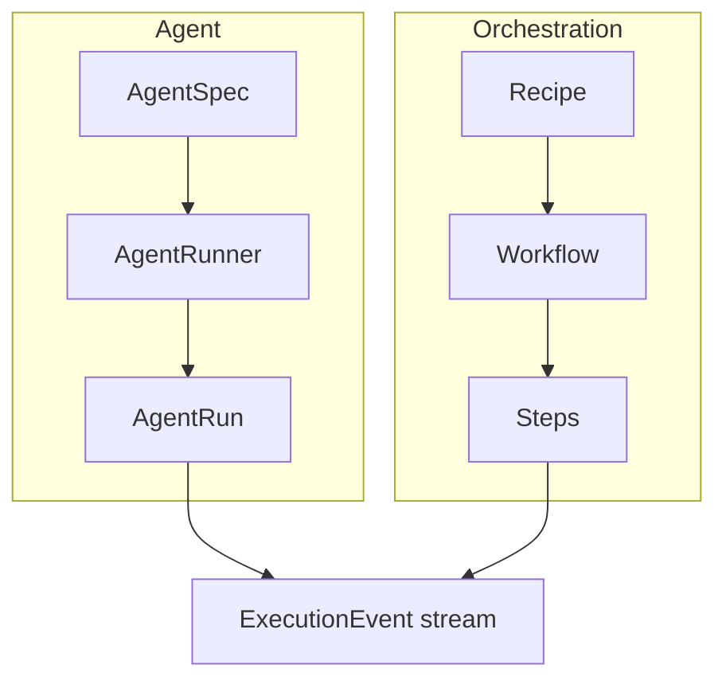
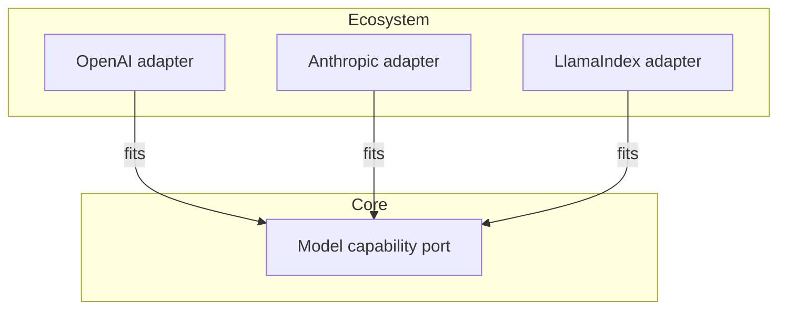

# Core Concepts

Four ideas shape how `llm-core` behaves:

1. **Descriptions are data.**
2. **Adapters are plugs.**
3. **Interactions are projections.**
4. **Steps are uniform.**

Each idea keeps the system predictable while staying flexible enough for real applications.
The names used below are defined once in the [Vocabulary](/reference/vocabulary).

## 1. Principle: Descriptions are Data

You describe the work you want as data, and let a runtime carry it out. `llm-core`
has two kinds of description, and they stay distinct:

- An **`AgentSpec`** describes a probabilistic **agent**: its model, its tools,
  and its policy. An [`AgentRunner`](/reference/vocabulary#agents) executes it and
  returns a live **`AgentRun`**.
- A **`Workflow`** describes explicit orchestration: a graph of author-defined
  **`Step`s**. A **`Recipe`** is a reusable, preconfigured `Workflow` you can name
  and share. The recipe catalogue lives in the [Cookbook](/recipes/).

The difference is the kind of control. A workflow is orchestration you author and
can reason about step by step. An agent loop is probabilistic: the model chooses
what to do next, within the policy the spec sets.


```mermaid
graph TD
    subgraph Agent
        Spec[AgentSpec] --> Runner[AgentRunner]
        Runner --> Run[AgentRun]
    end
    subgraph Orchestration
        Recipe[Recipe] --> WF[Workflow]
        WF --> Steps[Steps]
    end
    Run --> Events[ExecutionEvent stream]
    Steps --> Events
```

Either way, a description says _what_ you want to happen, and the runtime supplies
the _how_: sequencing, state, retries, and the trace.

### Sidebar: The Engine, called a Workflow

`Workflow` behaves like a compiler and a runtime in one place. It takes a recipe
and turns it into a directed acyclic graph (DAG) of executable steps, then runs
that graph with tracing and state management. An agent follows the same idea
through an `AgentRunner`: you hand it an `AgentSpec` and it produces an `AgentRun`.

This separation keeps your logic portable. The description captures intent in a
type-safe way; the runtime handles execution, state, retries, and trace
collection. The [Vocabulary](/reference/vocabulary) gives the shapes as they stand.

## 2. Principle: Adapters are Plugs

Adapters can feel abstract at first, so treat them as a simple electrical model.

- A **capability** acts as a **port** with a standard shape, such as a model port or a vector store port.
- **Adapters** act as the **appliances** that plug into those ports.


```mermaid
graph TD
    subgraph Core
    A[Model capability port]
    end

    subgraph Ecosystem
    O[OpenAI adapter]
    N[Anthropic adapter]
    L[LlamaIndex adapter]
    end

    O -- fits --> A
    N -- fits --> A
    L -- fits --> A
```

You define the port by saying "this spec needs a Model". Then you choose an
adapter, for example "use OpenAI" or "use Anthropic" or "use LlamaIndex".

Because the port has a stable contract, you can change provider, region, or
underlying client and keep the rest of your logic intact. Provider types stay
behind the adapter, so the swap stays local. This is what makes `llm-core`
interoperate cleanly with other ecosystems such as AI SDK, LangChain, and
LlamaIndex.

## 3. Principle: Interactions are Projections

Descriptions drive full runs. Interactions focus on a single turn and reshape model output into UI-friendly state.

An Interaction receives model or retrieval streams and **projects** them into an `InteractionState`. That state can power a chat window, a task panel, or another interactive surface.

Interaction-related pieces fall into three parts:

- **Interaction Core** turns an `InteractionEvent` stream into `InteractionState`.
- **Sessions** add storage and policy, which lets you persist state across turns or users.
- **UI SDK adapters** live outside core and convert events into UI-specific streams or commands.

Agentic flows use the same interaction stream but extend it with item and sub-agent lifecycle events. These are defined by the agent loop contract in `@geekist/llm-core/interaction`, which standardises `interaction.item.*` and `interaction.subagent.*` event semantics and deterministic resumable checkpoints, independent of the adapter ecosystem.

This structure makes it possible to build chat UIs, inspectors, or dashboards in environments that do not use the workflow runtime directly.

```ts
import { createInteractionHandle } from "@geekist/llm-core/interaction";

const interaction = createInteractionHandle();
const result = await interaction.run({
  message: { role: "user", content: "Hello!" },
});

console.log(result.state.messages);
```

Learn more in:

- [Interaction Core](/interaction/)
- [Interaction Sessions](/interaction/session)
- [UI SDK Adapters](/adapters/ui-sdk)

## 4. Principle: Steps are Uniform and use MaybePromise

In `llm-core`, every execution step follows the same shape and accepts both synchronous and
asynchronous work.

The guiding rule is simple: business logic reads as synchronous code, and the runtime takes care of waiting.

- Input can return a plain value `T` or a `Promise<T>`.
- The runtime decides when to await and how to compose results.
- You write small, focused functions, and they slot into pipelines without ceremony.

```ts
// This step is synchronous
const ValidationStep = (_, { input }) => {
  if (input.length > 100) {
    return { error: "Too long" };
  }
};

// This step is asynchronous
const DatabaseStep = async (_, { input }) => {
  await db.save(input);
};

// The runtime runs both through the same composition model.
```

This approach helps you avoid the usual "function colouring" problems where asynchronous code
spreads through an entire codebase. You can keep most utilities simple and only add `async`
behaviour where it earns its place.

## Reading a run back

How a run reports its conclusion depends on which description you ran. The two
are not the same type, on purpose.

**Workflows** report through an **`Outcome<T>`**, a discriminated union:

| Status   | Meaning             | What you receive                          |
| :------- | :------------------ | :---------------------------------------- |
| `ok`     | Run completed       | The full `artifact`                       |
| `paused` | Waiting on a signal | A `ResumableCheckpoint` to continue later |
| `error`  | Run failed          | The `error` and the events up to failure  |

**Agent runs** are a live lifecycle, not a single union. An
[`AgentRun`](/reference/vocabulary#agents) is a handle: while it runs it exposes
the `ExecutionEvent` stream and typed controls. It terminates exactly once, in one
terminal **`RunResult`**: `completed`, `failed`, `denied`, or `cancelled`.

### Why pausing is a control, not a result

A pause is not a terminal `RunResult`. Agentic systems often need to stop and wait
for a person, a tool result, or another service. Rather than throw, the run raises
an [`InterventionRequest`](/reference/vocabulary#control). When the runner supports
checkpoint resume it also hands back a `ResumableCheckpoint` you can store; you send
a notification, and later a `ResumeStrategy` continues the run — resume is
runner-owned and capability-gated — without losing the work already done. Keeping
suspension structured is what makes that recovery reliable.

## Key ideas to carry forward

An `AgentSpec` describes an agent; a `Recipe` packages a `Workflow` of `Step`s.
Both capture intent as portable data.
Adapters describe capabilities and allow provider choice without rewriting that description.
Interactions reshape model output into state that user interfaces can render and store.
Steps provide the smallest units of work and always follow the same `MaybePromise` shape.
A workflow ends in an `Outcome`; an agent run stays live as an `AgentRun` and ends in
one terminal `RunResult`. The `ExecutionEvent` stream preserves the trace either way.

These pieces work together so you can move from a small spec to a production workflow
while keeping a clear mental model of what the system is doing at each stage.
