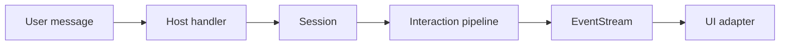

# End-to-End UI (Interaction + Host + Adapter)

This guide wires the full path from a single turn to UI commands:
Interaction core → sessions → UI adapter.

> [!NOTE] > **Demo path (3/4)** — Next up:
> [Workflow Orchestration](/guide/hello-world).

---

## How the UI boundary works



## Prerequisites

Install the adapter dependencies:

::: code-group

```bash [npm]
npm install ai @assistant-ui/react
```

```bash [pnpm]
pnpm add ai @assistant-ui/react
```

```bash [yarn]
yarn add ai @assistant-ui/react
```

```bash [bun]
bun add ai @assistant-ui/react
```

:::

---

## Step 1: Set up storage and adapters

::: code-group
<<< @/snippets/guide/end-to-end-ui.js#setup [JavaScript]
<<< @/snippets/guide/end-to-end-ui.ts#setup [TypeScript]
:::

This keeps persistence and UI output in the host layer while the interaction core stays headless.

---

## Step 2: Handle a chat turn and emit UI commands

::: code-group
<<< @/snippets/guide/end-to-end-ui.js#handler [JavaScript]
<<< @/snippets/guide/end-to-end-ui.ts#handler [TypeScript]
:::

Your app calls `handleChatTurn(...)` with a `sessionId`, a message, and a UI command sink. The
adapter turns interaction events into UI-specific commands.

---

## Swap UI adapters without touching interaction logic

The adapter is the only thing that changes:

```diff
- createAssistantUiInteractionEventStream
+ createAiSdkInteractionEventStream
```

The rest of the handler stays the same.

---

## Run the demo locally

The `examples/interaction-node-sse` app shows the same end-to-end path (Interaction → Session →
EventStream) in a tiny Node server.

```bash
# from the repo root
bun install
bun examples/interaction-node-sse/server.js
```

Then open:

```
http://localhost:3030
```

To hit the SSE endpoint directly:

```
http://localhost:3030/chat?sessionId=demo&message=Hello
```

---

## Next step

If you need multi-step orchestration (RAG, tools, HITL), move to full workflows:

- [Workflow Orchestration](/guide/hello-world)
