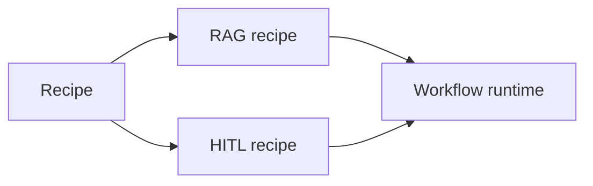

# Workflow Orchestration (RAG + HITL)

This guide shows how to orchestrate a full workflow: an agent that retrieves data (RAG), flows
through a deterministic pipeline, and can pause for human approval (HITL).

By the time you reach this page you’ve already seen the interaction stack; this is where you plug
those ideas into long‑running workflows.

If you are new to interactions, start here first:

- [Single-Turn Interaction](/guide/interaction-single-turn)
- [Sessions + Transport](/guide/interaction-sessions)

> [!NOTE] > **Demo path (4/4)** — Previous guides covered single‑turn interaction, sessions, and end‑to‑end UI.
> This page closes the loop with full workflow orchestration:
> interactions → sessions → UI adapters → workflows.

---

## Agent runtime quickstart

If you want the canonical agent loop without wiring recipes by hand, start with the agent runtime. It exposes a small `run`/`stream` surface while still using the same recipe system under the hood, and any internal packs remain an implementation detail behind that recipe surface.

::: code-group
<<< @/snippets/guide/agent-runtime.js#run [JavaScript]
<<< @/snippets/guide/agent-runtime.ts#run [TypeScript]
:::

## How workflows compose recipes

An agent workflow is assembled from recipes. In this example you attach the RAG recipe and the HITL recipe to the base agent recipe, and the workflow runtime executes them together as a single DAG:

---

## Step 1: Define the workflow

::: code-group
<<< @/snippets/guide/workflow-orchestration.js#setup [JavaScript]
<<< @/snippets/guide/workflow-orchestration.ts#setup [TypeScript]
:::

::: code-group
<<< @/snippets/guide/workflow-orchestration.js#build [JavaScript]
<<< @/snippets/guide/workflow-orchestration.ts#build [TypeScript]
:::

In this setup:

- the **RAG recipe** expects a `retriever` adapter and handles the query → documents → answer flow for you, and
- the **HITL recipe** adds a gate that can return a `paused` outcome when the workflow needs human approval.

---

## Step 2: Run and handle pause/resume

::: code-group
<<< @/snippets/guide/workflow-orchestration.js#run [JavaScript]
<<< @/snippets/guide/workflow-orchestration.ts#run [TypeScript]
:::

When the workflow returns `status: "paused"`, you get a token that captures the point‑in‑time
state. Store the token, present the pending decision to a human, and resume the workflow once
a decision has been made.

---

## Next steps

- [Composing Recipes](/guide/composing-recipes)
- [Debugging](/guide/debugging)
- [Adapters Reference](/reference/adapters-api)
