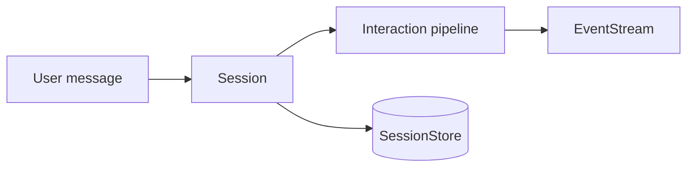

# Sessions + Transport (Multi-Turn)

This guide shows how to wrap the interaction loop with a session boundary and host transport. You get durable state, policy hooks, and a stream of events to your client — without changing the interaction core.

> [!NOTE] > **Demo path (2/4)** — You’ve seen single‑turn interaction. This page adds sessions.
> Next, wire it into a UI and then a full workflow:
>
> - [End-to-End UI](/guide/end-to-end-ui)
> - [Workflow Orchestration](/guide/hello-world)

---

## How sessions layer on top of interactions

Sessions sit alongside the interaction pipeline. Each turn flows through a session, into the interaction pipeline, out to an EventStream, and back into the store as updated state.

---

## Step 1: Define a SessionStore and EventStream

::: code-group
<<< @/snippets/guide/interaction-sessions.js#store [JavaScript]
<<< @/snippets/guide/interaction-sessions.ts#store [TypeScript]
:::

You provide two adapters: a `SessionStore` for persistence and an `EventStream` for outbound events. The store can be Redis, KV, Postgres, or in‑memory — anything that can load and save the interaction state behind a simple contract.

---

## Step 2: Create a session

::: code-group
<<< @/snippets/guide/interaction-sessions.js#session [JavaScript]
<<< @/snippets/guide/interaction-sessions.ts#session [TypeScript]
:::

A session is an orchestration wrapper around the interaction pipeline. Given a `sessionId`, it will load the previous state (if any), run the pipeline for the new turn, apply any policies, and persist the updated state — without leaking globals into your app.

---

## Step 3: Send a turn and read state

::: code-group
<<< @/snippets/guide/interaction-sessions.js#turn [JavaScript]
<<< @/snippets/guide/interaction-sessions.ts#turn [TypeScript]
:::

Sending a turn is just `session.send(message)`; you can then inspect the current state via `session.getState()`. If you stream to a browser, swap the `EventStream` implementation for SSE, WebSocket, or a worker stream — the interaction layer itself stays exactly the same.

---

## Next step

See the UI boundary in action:

- [End-to-End UI](/guide/end-to-end-ui)
