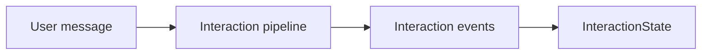

# Single-Turn Interaction (UI-Ready State)

This guide shows how to take **one model turn** and project it into a stable, UI‑ready
`InteractionState`.

At this layer you work entirely within the interaction pipeline:

- The workflow runtime stays out of the picture.
- Sessions and storage live elsewhere.
- The flow is a single path: _input → interaction pipeline → state_.

It’s the lightest layer in the stack and it anchors everything above it.

> [!NOTE] > **Demo path (1/4)** — Start here, then go to
> [Sessions + Transport](/guide/interaction-sessions) →
> [End-to-End UI](/guide/end-to-end-ui) →
> [Workflow Orchestration](/guide/hello-world).

---

## How the single-turn flow works

At a high level:

- The **user message** is wrapped as an interaction input.
- The **interaction pipeline** runs a small set of steps (validation, model call, reduction).
- Those steps emit **interaction events**.
- The **interaction reducer** folds events into a single `InteractionState`.

The important bit: the reducer always produces the same shape, regardless of which model
provider or UI library you use on top.

---

## Step 1: Create the pipeline and model

::: code-group
<<< @/snippets/guide/interaction-single-turn.js#setup [JavaScript]
<<< @/snippets/guide/interaction-single-turn.ts#setup [TypeScript]
:::

The pipeline is **pure interaction logic** — it doesn’t know about HTTP, WebSockets, or any UI.
Models are plugged in via adapters, so you can develop against the built‑in model and swap to
OpenAI/Anthropic/LangChain/LlamaIndex later without changing the interaction flow.

---

## Step 2: Run one turn

::: code-group
<<< @/snippets/guide/interaction-single-turn.js#run [JavaScript]
<<< @/snippets/guide/interaction-single-turn.ts#run [TypeScript]
:::

The runner takes:

- `input.message`: the current user message.
- `input.state` (optional): an existing `InteractionState` to append to.
- `adapters`: a `model` adapter (and any other adapters you choose to provide).

The call returns a **`MaybePromise`**:

- If the adapter is synchronous (e.g. a mocked model), the result is returned synchronously.
- If the adapter is asynchronous (real HTTP calls), the result is a `Promise`.

That means the pipeline itself never forces `async` onto your whole codebase: you can choose to
`await` the result when you actually plug in remote models.

---

## Step 3: Read state (and handle pauses)

::: code-group
<<< @/snippets/guide/interaction-single-turn.js#read [JavaScript]
<<< @/snippets/guide/interaction-single-turn.ts#read [TypeScript]
:::

The run outcome is either:

- A **run result** with `artefact: InteractionState`.
- A **paused snapshot** with `__paused: true` and a `snapshot` token (if a step deliberately
  pauses the interaction).

In the common case (no pause), you read from:

- `state.messages`: UI‑ready messages (user/assistant/tool).
- `state.events` (optional): a log of interaction events if `captureEvents` is enabled.
- `state.trace` / `state.diagnostics`: always present, so you can debug what happened.

If you enable `captureEvents` and start with `state.events = []`, the reducer appends events
in order as the pipeline runs. This is the same event stream that host transports and UI adapters
use later on.

---

## Why this is better than ad‑hoc streaming

Without interaction core, you typically:

- Stream raw chunks from an SDK (OpenAI, Anthropic, etc.).
- Manually stitch them into strings.
- Update UI state by mutating arrays and flags all over your app.

With interaction core:

- The **reducer** turns provider‑specific chunks into a stable `InteractionState`.
- Message history, partial completions, and tool calls all share one consistent shape.
- You can replay or inspect the same state in tests, on the server, or in the browser.

Your UI never has to care whether the model is OpenAI, Anthropic, or a local mock — it just reads
`InteractionState`.

---

## Next step

If you need persistence and multi‑turn sessions, continue to:

- [Sessions + Transport](/guide/interaction-sessions)
