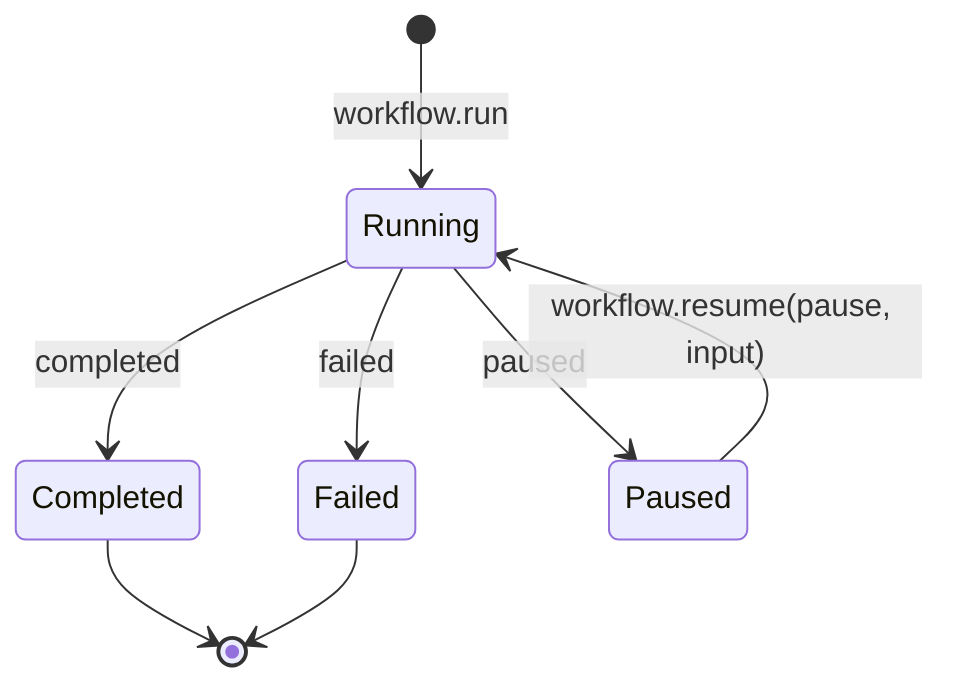
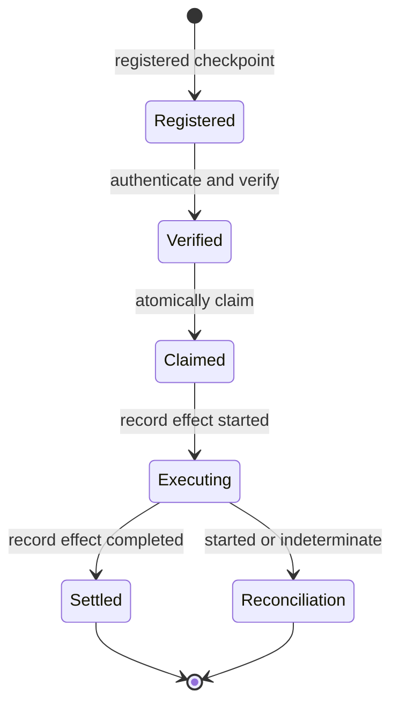

# Build and resume a workflow

`defineWorkflow` turns an ordered `WorkflowConfig` into a ready `Workflow`.
The workflow owns ordinary `run` and `resume` operations and returns a
`WorkflowResult`.

## Choose the matching workflow path

| Need                                    | API                                  | State carried forward                     |
| --------------------------------------- | ------------------------------------ | ----------------------------------------- |
| Run ordered passive steps               | `workflow.run`                       | State in a `completed` or `failed` result |
| Pause passive orchestration             | `workflow.run`                       | Ephemeral `WorkflowPause`                 |
| Continue an ephemeral pause             | `workflow.resume`                    | Pause plus resume input                   |
| Resume after an authorized intervention | Runtime `resumeInterventionWorkflow` | Registered durable checkpoint and journal |

`defineWorkflow` validates the config, allocates an identity when one is not
supplied, and defaults the version to `1`. Every common `WorkflowStep` has
`effect: "none"`. Runtime composition, registries, and meaningful-effect
resume are explicit extension APIs on `@geekist/llm-core/workflow/runtime`.

## Follow the lifecycle

The passive snapshot is explicitly ephemeral and is not a durable checkpoint.
Use it to continue an in-process workflow. Do not store it as proof that an
external effect can be safely replayed.

## Resume a controlled intervention

The checked example starts from a fully constructed
`ResumeInterventionWorkflowInput` and handles the outcome that needs operational
reconciliation.

<<< @/snippets/v2/workflow-resume.ts

A complete controlled-resume input supplies:

1. a `RegisteredResumableCheckpoint`, its matching intervention, and an
   authenticated decision;
2. expected runtime, schema, code, checkpoint-format, and native-reference
   compatibility;
3. an action-digest verifier, authentication port, clock, and authoritative
   resume journal;
4. the exact ordered steps for that workflow version.

The journal atomically consumes the decision and claims the checkpoint. Before
a meaningful step executes, it durably records the effect as `started`.
Completion records the resulting effect and state.

If an existing effect is `started` or `indeterminate`, the outcome is
`reconciliation-required`. The workflow does not blindly replay it. Likewise,
`deferred`, `edit-requires-new-binding`, and `escalated` resolve the
intervention without pretending that checkpoint execution completed.

Continue with [controlled tool execution](/orchestration/controlled-tool-execution) or
review the [API by subpath](/reference/api).
