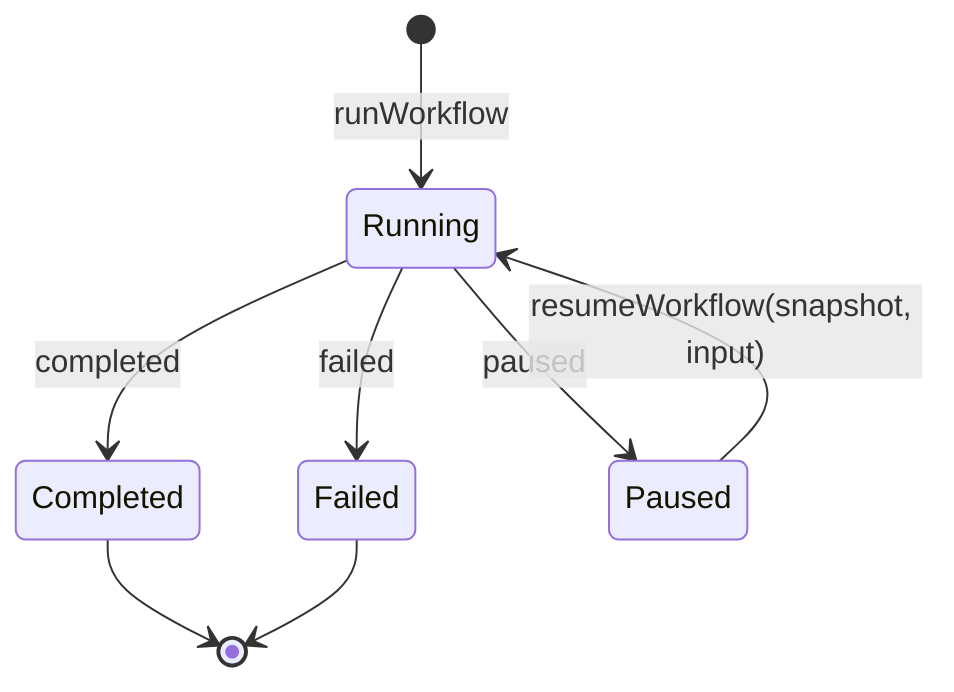
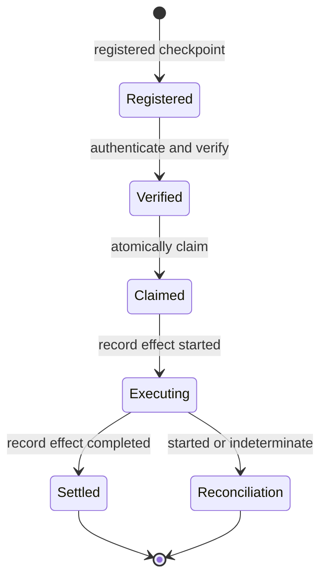

# Build and resume a workflow

A `WorkflowDefinition` describes ordered, author-defined steps. The general
workflow runtime executes passive steps and returns a
`WorkflowExecutionOutcome`.

## Choose the matching workflow path

| Need                                    | API                          | State carried forward                      |
| --------------------------------------- | ---------------------------- | ------------------------------------------ |
| Run ordered passive steps               | `runWorkflow`                | State in a `completed` or `failed` outcome |
| Pause passive orchestration             | `runWorkflow`                | Ephemeral `WorkflowPauseSnapshot`          |
| Continue an ephemeral pause             | `resumeWorkflow`             | Snapshot plus resume input                 |
| Resume after an authorized intervention | `resumeInterventionWorkflow` | Registered durable checkpoint and journal  |

`defineWorkflow` validates a definition. `composeWorkflow` combines ordinary
definitions, and `createWorkflowRegistry` resolves registered definitions by identity.
Every general-runtime step has `effect: "none"`. Meaningful effects use the
controlled intervention path.

## Follow the lifecycle

The passive snapshot is explicitly ephemeral and is not a durable checkpoint.
Use it to continue an in-process workflow. Do not store it as proof that an
external effect can be safely replayed.

## Resume a controlled intervention

The checked example starts from a fully constructed
`ResumeInterventionWorkflowInput` and handles the outcome that needs operational
reconciliation.

<<< @/snippets/v2/workflow-resume.ts

A complete controlled-resume input supplies:

1. a `RegisteredResumableCheckpoint`, its matching intervention, and an
   authenticated decision;
2. expected runtime, schema, code, checkpoint-format, and native-reference
   compatibility;
3. an action-digest verifier, authentication port, clock, and authoritative
   resume journal;
4. the exact ordered steps for that workflow version.

The journal atomically consumes the decision and claims the checkpoint. Before
a meaningful step executes, it durably records the effect as `started`.
Completion records the resulting effect and state.

If an existing effect is `started` or `indeterminate`, the outcome is
`reconciliation-required`. The workflow does not blindly replay it. Likewise,
`deferred`, `edit-requires-new-binding`, and `escalated` resolve the
intervention without pretending that checkpoint execution completed.

Continue with [controlled tool execution](/orchestration/controlled-tool-execution) or
review the [API by subpath](/reference/api).
