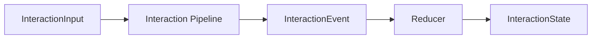

# Interaction Core (Pipeline-Backed)

Interaction Core is a small, runtime-agnostic layer for turning adapter streams into deterministic,
UI-ready state. It does **not** depend on the workflow runtime or recipes. Think of it as a thin
projection layer: you feed it model/query streams, it gives you `InteractionState`.

Use it when you want a lightweight interaction loop (chat UI, tool panel, streaming view) without
the full workflow runtime.

---

## 1) Quick start (JS-only)

If you already have a model adapter, the defaults are enough.

<<< @/snippets/interaction/quick-start.js#docs

What you get back:

- `result.artifact` is the current `InteractionState`.
- `result.artifact.messages` is UI-ready (assistant/user/tool messages).
- `diagnostics` and `trace` are always present on the state.

---

## 2) Handle wrapper

If you want a flatter API without pipeline wiring, use the handle wrapper.

<<< @/snippets/interaction/handle.js#docs

The handle follows the same shape as recipe handles (`configure`, `defaults`, `use`, `explain`,
`build`, `run`) so you can carry one mental model across layers.

---

## 3) What gets reduced into state

The reducer understands existing adapter stream shapes:

- `ModelStreamEvent` → assistant message parts
- `QueryStreamEvent` → tool messages with data parts
- `DiagnosticEntry` + `TraceEvent` → append-only state (exported from `@geekist/llm-core`)

Raw provider payloads stay in `state.private.raw` and **never** leak into messages.

---

## 4) Event ordering (deterministic)

Every `InteractionEvent` carries a `meta.sequence`. Older or duplicate sequences are ignored, so
you can safely replay or merge streams.

If you want to collect events for audit or replay, initialize `state.events = []` and the reducer
will append to it.

---
