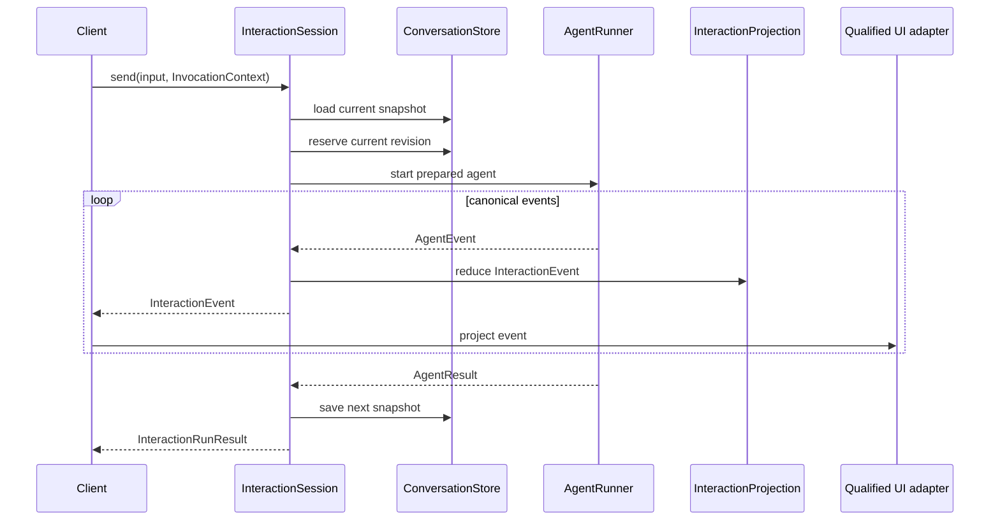

# Conversations and interaction

`createConversation` is the common application API. It accepts a ready `Agent`
and an optional `ConversationStore`, then exposes `send` for one result and
`stream` for projected `ConversationEvent` values.

<<< @/snippets/v2/conversation.ts

Use the `./interaction` extension API when the host must supply an
`AgentRunner`, prepared definition, explicit identity allocation, controlled
execution evidence, registered content events, or live reconnection.

<<< @/snippets/v2/interaction-projection.ts

```mermaid
sequenceDiagram
  participant Client
  participant Session as InteractionSession
  participant Store as ConversationStore
  participant Runner as AgentRunner
  participant Projection as InteractionProjection
  participant UI as Qualified UI adapter

  Client->>Session: send(input, InvocationContext)
  Session->>Store: load current snapshot
  Session->>Store: reserve current revision
  Session->>Runner: start prepared agent
  loop canonical events
    Runner-->>Session: AgentEvent
    Session->>Projection: reduce InteractionEvent
    Session-->>Client: InteractionEvent
    Client->>UI: project event
  end
  Runner-->>Session: AgentResult
  Session->>Store: save next snapshot
  Session-->>Client: InteractionRunResult
```

The reservation happens before runner execution. This matters because an
optimistic comparison after execution cannot make a meaningful effect safe to
repeat.

## Three event families

An `InteractionEvent` wraps exactly one canonical family:

- `agent-run` carries an `AgentEvent`;
- `tool-execution` carries redacted `ToolExecutionEvent` evidence;
- `content` carries a registered `InteractionContentEvent`.

The reducer projects these families into `ConversationEvent` values. UI
adapters consume that projection. They do not become execution, receipt, or
persistence authorities.

## State and continuity

The completed interaction result contains a portable `ConversationSnapshot`.
That snapshot is a point-in-time value, not a resumable workflow checkpoint.
Provider continuity remains an opaque `ProviderSessionRef`.

`InteractionRun.continuation` is different. It is a process-local
`LiveContinuation` that reconnects to the same live connection while that
connection still exists.

Continue with [events and projections](/interaction/events),
[sessions](/interaction/sessions), or
[reconnect and transport](/interaction/transport).
