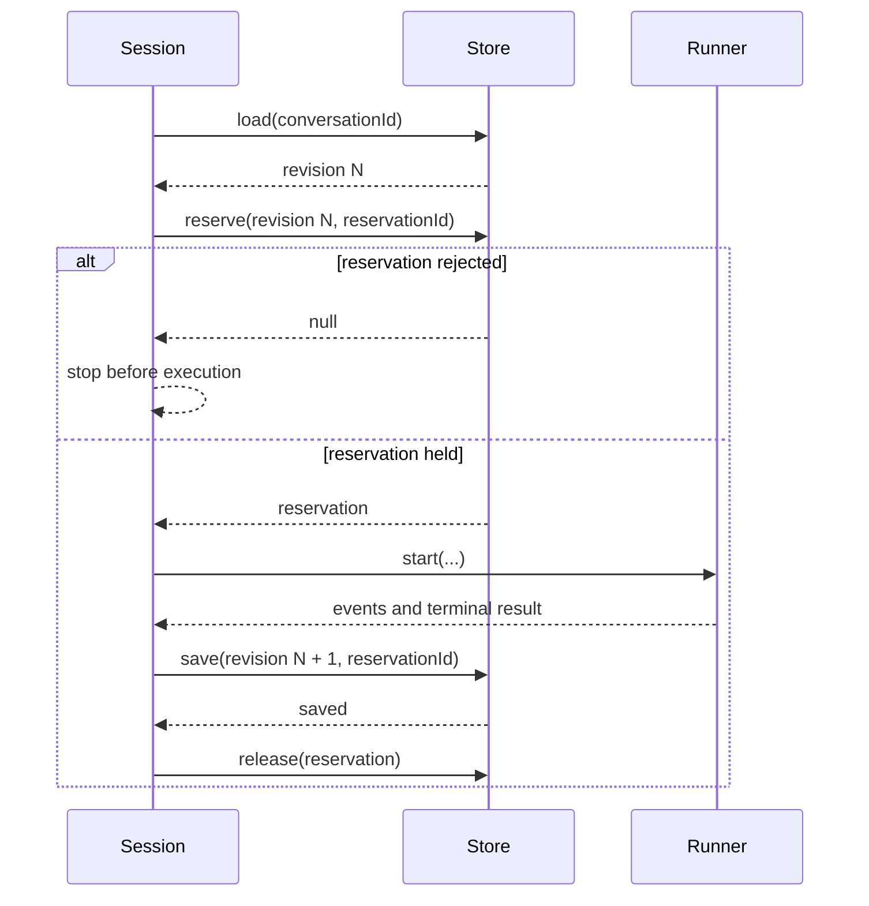

# Sessions

`createInteractionSession` gives one conversation exclusive execution and
snapshot ownership around an `AgentRunner`.

## Required ports

| Option           | Responsibility                                               |
| ---------------- | ------------------------------------------------------------ |
| `conversationId` | Canonical conversation identity                              |
| `agent`          | Prepared agent specification                                 |
| `runner`         | Starts the agent run and reports capabilities                |
| `store`          | Loads, reserves, saves, and releases conversation revisions  |
| `identity`       | Supplies timestamps plus snapshot and reservation identities |

The session exposes an `executionEventSink` for controlled tool evidence and
`emitContent` for registered content events. Both bind incoming events to the
active conversation run before reduction.

## Reservation lifecycle

A conforming store grants at most one reservation for a conversation revision.
`save` consumes only the still-held reservation. `release` is idempotent
cleanup.

The session also prevents concurrent runs within one process. That local guard
does not replace the store reservation, which protects the revision across
hosts.

## Stored value

`ConversationSessionSnapshot` contains:

- terminal conversation turns;
- the deterministic interaction projection;
- an optional opaque `ProviderSessionRef`;
- the conversation revision.

Loaded snapshots cross a strict registration boundary. Identity, closed shapes,
portable JSON, projection indexes, terminal status, message lifecycle, and
provider-session facts are validated before the value is accepted.

## Failure posture

If reservation fails, the runner does not start. If the runner or persistence
fails, the reservation is released during cleanup. A failed save does not
authorize replay of a meaningful effect. Recovery must follow the receipt and
reconciliation rules of the controlled execution path.
