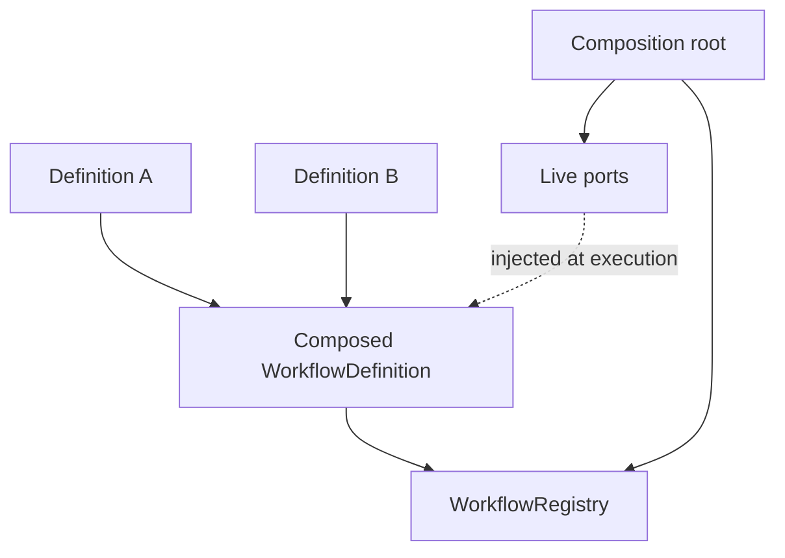

# Composition patterns

Composition should make execution order obvious while keeping capability rules
inside their own ports.

## Compose definitions, not hidden authority

`composeWorkflow` concatenates the steps from existing definitions, followed by
any explicitly supplied steps. It validates the resulting identity and step
keys through `defineWorkflow`.

Use it when several applications share an ordered passive sequence. Keep policy,
receipt persistence, credentials, and provider clients in the composition root,
then pass them through explicit ports to the controlled path that needs them.

## Prefer small step contracts

A step should:

1. read the workflow state;
2. call one passive capability or make one local decision;
3. return a new state or a named pause.

If a step begins to own policy, provider translation, persistence, and
presentation together, split those responsibilities and keep the step as the
sequencer.

## Keep state meaningful

Use a named state type when values travel across multiple steps. This makes
transitions reviewable and keeps provider-native objects out of snapshots.
Choose a small pause type that tells the caller what input is needed to resume.

## Treat recipes as application vocabulary

An application may call a recurring composition a recipe. `Recipe` is not a
public llm-core type, and the package does not export a `/recipes` subpath. Use
`WorkflowDefinition`, capability ports, and your own application-level name.

## Preserve sync-or-async composition

Workflow steps return `MaybePromise`. Do not wrap a synchronous capability in a
promise merely to fit the workflow. The runtime composes synchronous and
asynchronous steps while preserving the behavior each port already provides.
