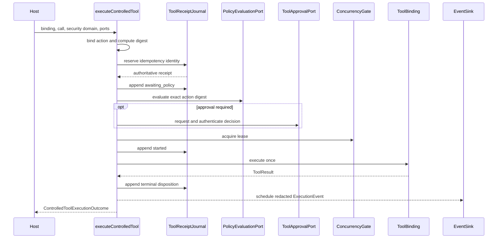

# Controlled tool execution

Meaningful tool effects fail closed. `executeControlledTool` does not call a
tool until the action is bound, the durable receipt is reserved, required
policy and approval checks succeed, and a concurrency lease is acquired.

<<< @/snippets/v2/controlled-tool-execution.ts

## One authority chain

The journal and gate solve different problems. The
`ToolReceiptJournal` establishes durable identity and recovery state. The
`ConcurrencyGate` limits overlapping live work. An `EventSink` projects
evidence, but it is neither persistence nor execution authority.

## Outcomes

`ControlledToolExecutionOutcome` makes coordination visible:

| Status                                     | Meaning                                                                 |
| ------------------------------------------ | ----------------------------------------------------------------------- |
| `succeeded`, `failed`                      | The binding returned a terminal `ToolResult`.                           |
| `awaiting-approval`, `cancelled`, `denied` | Control stopped before execution or followed an authoritative decision. |
| `existing`                                 | The reservation resolved to an existing terminal receipt.               |
| `indeterminate`                            | Execution may have started, but completion is not authoritative.        |
| `conflict`                                 | The idempotency identity is already bound to a different receipt.       |

Completed receipt outcomes also report event delivery as `scheduled`, `failed`,
or `not-configured`. Delivery failure does not erase a durable receipt.

## Redaction and native data

Supply explicit `RedactionMetadata` for sensitive categories. Canonical
`ExecutionEvent` values contain action digests, receipt state, safe control
facts, and optionally already-redacted extensions. They do not carry raw tool
arguments or results.

## Durable intervention resume

`resumeInterventionWorkflow` is the workflow-level path for an authenticated
decision against a registered checkpoint. Its journal atomically consumes the
decision, claims the checkpoint when execution will continue, records
meaningful effects, and commits or quarantines the outcome.

If an effect is `started` or its state is indeterminate, the outcome is
`reconciliation-required`. Automatic replay is not authorized.
