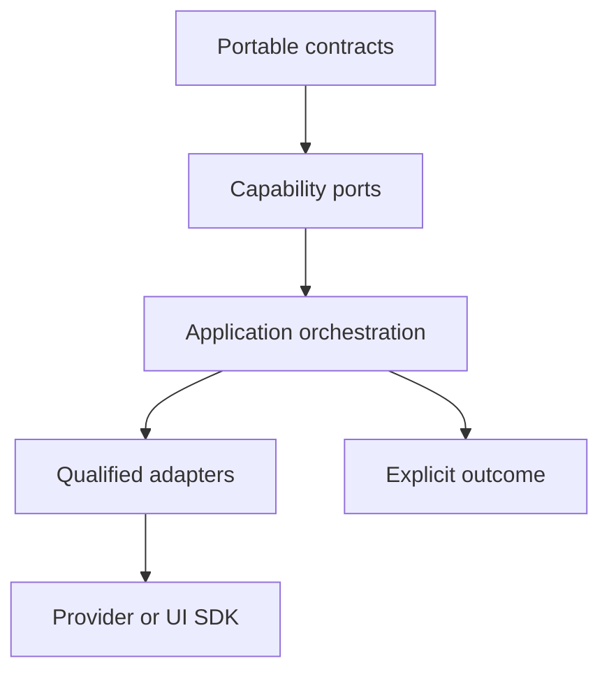

# Orchestration

Orchestration turns independent capabilities into an application story. In
llm-core, that work belongs to the `/workflow` and `/control` subpaths rather
than to a model, tool, store, or adapter.

This direction keeps three responsibilities separate:

| Layer         | Owns                                                    | Does not own                 |
| ------------- | ------------------------------------------------------- | ---------------------------- |
| Capability    | One contract and its guarantees                         | Cross-capability sequencing  |
| Orchestration | Ordering, pause, retry, rollback, and controlled resume | Provider-native data         |
| Adapter       | Translation at an external boundary                     | Policy or workflow authority |

## Two execution paths

The general workflow runtime executes passive steps. Every
`WorkflowStep` declares `effect: "none"`, and `Workflow.run` rejects a workflow
that does not.

Meaningful effects take the controlled path. `executeControlledTool` coordinates
policy, approval, concurrency, durable receipts, execution, and redacted event
delivery. A durable intervention resume uses runtime
`resumeInterventionWorkflow`, a `WorkflowResumeJournal`, and returns a
`ControlledWorkflowResult`.

This is a deliberate split. An ephemeral workflow pause is useful for in-process
coordination. It is not evidence that a side effect can be repeated safely.

## Choose the next page

- [Workflows](/orchestration/workflows) explains ordered passive steps,
  pause/resume, retry, and rollback.
- [Controlled tool execution](/orchestration/controlled-tool-execution)
  explains the fail-closed path for meaningful effects.
- [Composition patterns](/orchestration/composition-patterns) shows how to
  assemble reusable workflows without creating hidden execution authority.
