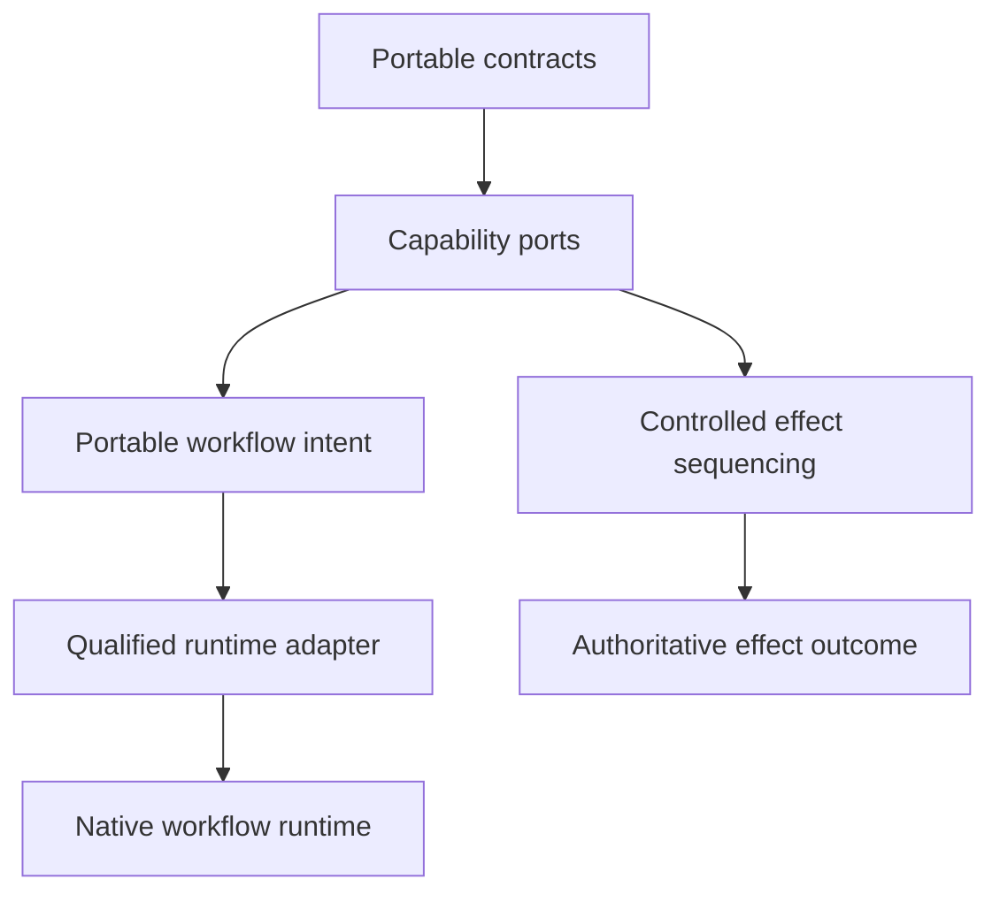

# Orchestration

Orchestration turns independent capabilities into an application story without making the kernel a workflow engine. `llm-core` owns portable workflow intent and the controlled path for meaningful tool effects. A selected runtime integration owns native ordering, branching, pause, retry, rollback, and resume semantics.

This direction keeps three responsibilities separate:

| Layer | Owns | Does not own |
| --- | --- | --- |
| Kernel capability | Portable contracts and their guarantees | Native workflow execution |
| Controlled effect | Policy, approval, receipt, concurrency, and effect sequencing | A general workflow runtime |
| Runtime integration | Native execution semantics and runtime authority | Portable kernel contract definitions |
| Adapter projection | Explicit mapping and conversion-loss reporting | Universal checkpoint portability |

## Two separate responsibilities

The `/workflow` front describes portable intent. It does not expose a local `Workflow.run`, `runWorkflow`, or resume engine. A qualified adapter projects supported intent into LangGraph, Temporal, Mastra, or another selected runtime.

Meaningful effects take the controlled path. `executeControlledTool` coordinates policy, approval, concurrency, durable receipts, execution, and redacted event delivery. A runtime may use those contracts inside its own workflow, but the kernel does not take ownership of that workflow.

This is a deliberate split. Native pause or checkpoint state is not evidence that a side effect can be repeated safely.

## Choose the next page

- [Workflows](/orchestration/workflows) explains portable intent and adapter-owned execution.
- [Controlled tool execution](/orchestration/controlled-tool-execution) explains the fail-closed path for meaningful effects.
- [Composition patterns](/orchestration/composition-patterns) shows how to assemble reusable workflows without creating hidden execution authority.
