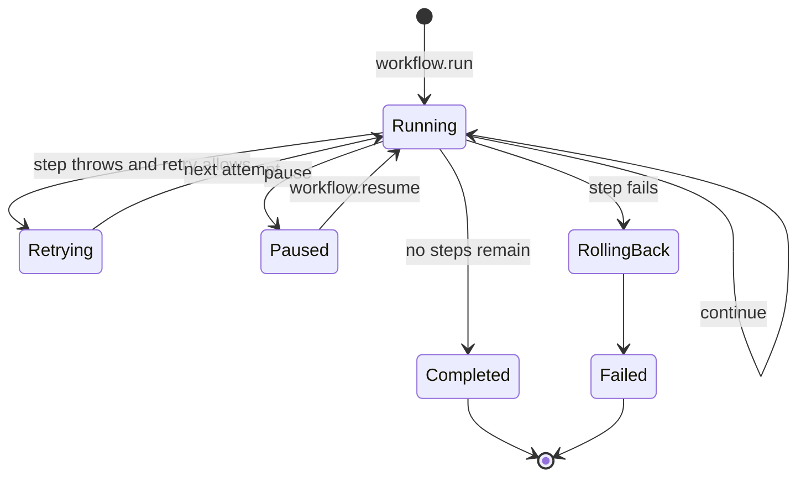

# Workflows

A `WorkflowConfig` is an ordered list of passive `WorkflowStep` values.
`defineWorkflow` turns that config into a ready `Workflow`. Each step receives
the current state, an optional resume input, and its attempt number, then
returns a `WorkflowStepResult`.

<<< @/snippets/v2/workflow-composition.ts

`Workflow.run` and `Workflow.resume` preserve `MaybePromise` behavior. A fully
synchronous workflow can complete synchronously; asynchronous steps can return
promises without changing the contract.

## Execution lifecycle

The `WorkflowResult` is one of:

| Status      | Carries                                            |
| ----------- | -------------------------------------------------- |
| `completed` | Final state and completed step keys                |
| `paused`    | An ephemeral `WorkflowPause`                       |
| `failed`    | The failing step, error, and any rollback failures |

`paused` returns control from the current invocation but is not terminal for
the workflow lifecycle. A compatible `workflow.resume` call continues it.

## Pause and resume

A paused transition chooses one of two rollback modes:

- `retain` keeps completed steps and resumes the paused step with the supplied
  resume input.
- `restart` rolls completed steps back in reverse order and resumes at step
  zero.

The snapshot records `durability: "ephemeral"` and `checkpoint: false`.
`Workflow.resume` verifies the workflow identity, version, and completed-step
prefix before it continues. Use the durable intervention path when a decision
or meaningful effect must survive a process boundary.

## Retry and rollback

`WorkflowRetryPolicy.maxAttempts` counts the initial call. `shouldRetry`
controls which errors qualify, while `delayMs` may be a fixed delay or a
function of the error and attempt.

When a step ultimately fails, the runtime invokes rollback handlers for
completed steps in reverse order. Rollback failures are reported with the
original failure rather than hiding it.

## Identity and registration

`defineWorkflow` validates unique, non-empty step keys. It allocates an identity
when `workflowId` is omitted and defaults an omitted version to `1`. Runtime
hosts that need composition or registration can import `composeWorkflow` and
`createWorkflowRegistry` from `@geekist/llm-core/workflow/runtime`. The registry
stores ready workflows by identity and rejects accidental replacement. Use an
explicit `{ replace: true }` only when the composition root intends to replace
a registration.
