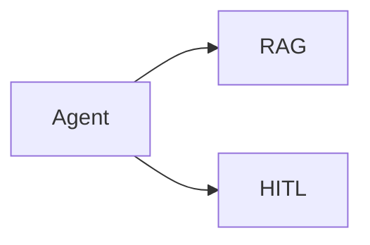

# Recipe: Agent (Reason + Act)

> [!NOTE]
> Goal: Build a tool-calling agent that can plan, act, and finalise with clean diagnostics and a stable recipe surface.

The Agent recipe is the most complete example of the recipe-first API. It runs a ReAct-style loop that plans, calls tools, executes them, and then responds. The loop stays explicit and the outcome always keeps diagnostics and trace attached, so every run leaves a clear audit trail.

Reach for this recipe when you want a dependable core for support agents, operations helpers, triage bots, and internal copilots. The agent loop gives you a stable "do the right thing" behaviour across these use cases, without ad-hoc wiring each time.

You also gain a stable orchestration skeleton that can include retrieval, human-in-the-loop (HITL) gates, and tool execution while the public surface stays the same. The recipe takes a clear position on structure while remaining neutral about providers, so you can change ecosystems as your stack evolves.

If you are new to recipes, start with the [Recipes API](/reference/recipes-api). For adapter wiring, see the [Adapters overview](/adapters/).


---

## 1) Quick start (one model and one tool)

This is the minimum setup: a model adapter, a tool adapter, and a call to `run()`. The recipe is configured once and then reused across many requests, so you keep input clean and separate from wiring. If your goal is only the agent loop, this is enough.

::: code-group

```bash [npm]
npm install ai zod @ai-sdk/openai
```

```bash [pnpm]
pnpm add ai zod @ai-sdk/openai
```

```bash [yarn]
yarn add ai zod @ai-sdk/openai
```

```bash [bun]
bun add ai zod @ai-sdk/openai
```

:::

::: tabs
== JavaScript

<<< @/snippets/recipes/agent/quick-start.js#docs

== TypeScript

<<< @/snippets/recipes/agent/quick-start.ts#docs

:::

The runtime input stays small. `AgentInput` is the user prompt with optional context and documents. Behavioural choices live in configuration and defaults rather than in per-call input.

Outcomes are explicit. Every run returns `{ status, artefact, diagnostics, trace }`.

- When the agent completes, `status === "ok"` and the artefact carries the final answer.
- When the agent pauses, `status === "paused"` and the outcome includes a resume token together with trace and diagnostics up to that point.
- When the agent fails, `status === "error"` and the outcome still carries the same trace and diagnostics so you can see what happened.

This structure gives you a single outcome surface that fits simple bots, long-running processes, and interactive tools.

---

## 2) Configure per-pack defaults (typed)

`configure()` is recipe-specific and scoped to the agent packs for planning, tools, memory, and finalisation. Use this when you want defaults that apply only to specific parts of the loop.

- Planning controls how the agent interprets the user request and chooses a next action.
- Tools define which actions the agent is allowed to take and how those actions map to concrete tool adapters.
- Memory governs how the agent reads and writes context across turns.
- Finalise determines how the agent turns intermediate state into a final answer.

This is how you shape the personality and working style of your agent without changing the core flow. You can keep a planning policy stable, swap in a different tool set later, and tune memory decisions independently of the rest of the recipe.

The type stays explicit and local. `AgentRecipeConfig` is the only configuration structure that `configure()` accepts here, so each field you set belongs to this recipe rather than to a global configuration layer.

::: tabs
== JavaScript

<<< @/snippets/recipes/agent/defaults.js#docs

== TypeScript

<<< @/snippets/recipes/agent/defaults.ts#docs

:::

Pack-level defaults stay separate from run-level overrides. See [Recipe handles](/reference/recipes-api#recipe-handles-the-public-surface) for more about that separation.

Common adjustments are straightforward.

- For a tool-only agent, configure the finalise pack to skip synthesis or use a tool-focused finalisation policy.
- For retrieval, compose RAG into the flow as described further below.
- For stronger guarantees, use strict diagnostics at runtime so missing adapters or schema mismatches appear as early failures instead of vague behaviour.

---

## 3) Mix and match adapters (ecosystem-agnostic)

You can combine adapters from different ecosystems as long as they follow the same adapter shape. This is the main interoperability promise. You choose the best provider for each capability and the recipe still behaves in a consistent way.

The examples below use an AI SDK model together with tools from LlamaIndex. You can invert that, or bring in LangChain models and tools, or swap in your own primitive adapters. The agent loop and outcome shape stay the same.

::: tabs
== JavaScript

<<< @/snippets/recipes/agent/adapters.js#docs

== TypeScript

<<< @/snippets/recipes/agent/adapters.ts#docs

:::

You can also override adapters per run without rebuilding the recipe. This is useful for fallbacks or A/B testing, for example:

```ts
agent.run(input, {
  adapters: {
    model: fastModel,
  },
});
```

That pattern keeps the public surface stable while you experiment with different providers.

---

## 4) Diagnostics and trace (observability you always get)

Every run returns trace and diagnostics. This keeps the agent explainable in real usage, even when it appears to work. You can see which tools were chosen, which steps ran, and how the model moved from one decision to the next.

At runtime you can choose how strict you want this layer to be. In strict mode, missing adapters, invalid tool calls, or schema mismatches behave like hard failures. That is a good fit for production agents where you prefer a visible error over a silent misconfiguration.

If the agent pauses because of a human gate or a long wait, the paused outcome still carries trace and diagnostics. When you resume, execution continues with the same context and the same history.

<<< @/snippets/recipes/agent/diagnostics.js#docs

Read more in [Runtime diagnostics](/reference/runtime#diagnostics) and [Runtime trace](/reference/runtime#trace).

---

## 5) Composition and explain (power without magic)

Recipes are composable. The `.use()` method merges packs and defaults. The `.explain()` method shows the resulting directed graph of steps. This keeps ordering explicit and lets you understand the flow without reading internal plumbing.

The explain output is plain data. You can render it, store it, diff it between versions, or surface it in a UI for debugging and review.




<<< @/snippets/recipes/agent/composition.js#docs

Related references: the [Explain API](/reference/recipes-api#explain-see-the-graph) and the [composition model](/reference/composition-model).

For a compact mental model, think of `recipes.rag()` as retrieval and `recipes.hitl()` as a human gate. When you drop them into the agent, the flow stays explicit and each piece remains configurable on its own.

---

## 6) Why Agent is special

Agent is the recipe that intentionally loops and can pause in the middle of execution. That makes it the canonical orchestration example in this library. Planning, tool execution, memory updates, and final synthesis are distinct stages with clear dependencies.

You can use this recipe as the stable core for support agents, workflow copilots, automation runners, and other long-running flows. As models, tools, and providers change, the loop structure and outcome shape remain steady, so existing logs, dashboards, and tests stay useful.

---

## 7) Composition quick map

If you are deciding what to plug into an agent, the most common pairings are:

- [RAG](/recipes/rag) for retrieval
- [HITL](/recipes/hitl) for a human gate
- [Ingest](/recipes/ingest) to index or refresh content before a run

Each of these recipes carries its own defaults, diagnostics, and explain view. You can still override adapters per run to swap providers as your stack evolves.

---

## Implementation

- Source: [`src/recipes/agentic/agent/index.ts`](https://github.com/theGeekist/llm-core/blob/main/src/recipes/agentic/agent/index.ts)
- Packs: [`src/recipes/agentic/planning`](https://github.com/theGeekist/llm-core/blob/main/src/recipes/agentic/planning)
  - [`tools`](https://github.com/theGeekist/llm-core/blob/main/src/recipes/agentic/tools)
  - [`finalize`](https://github.com/theGeekist/llm-core/blob/main/src/recipes/agentic/finalize)
  - [`memory`](https://github.com/theGeekist/llm-core/blob/main/src/recipes/agentic/memory)
