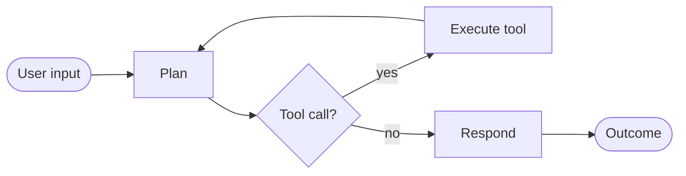
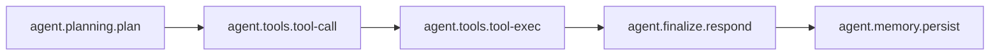
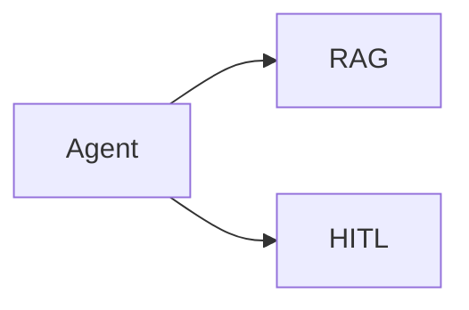

# Recipe: Agent (Reason + Act)

> [!NOTE] > **Goal**: Build a tool-calling agent that can plan, act, and finalize with clean diagnostics and a stable recipe surface.

The Agent recipe is the most complete example of the **recipe-first** API. It runs a ReAct-style loop
(plan -> tool-call -> tool-exec -> respond) while keeping diagnostics and trace attached to every outcome.
You reach for it when you want a dependable “do the right thing” core for support agents, ops helpers,
triage bots, and internal copilots, without re‑stitching glue code each time. The loop is explicit, the
inputs are stable, and the runtime guarantees (outcomes, diagnostics, trace) are always there.

If you need a stable orchestration skeleton that can absorb retrieval, HITL gates, or tool execution
without changing the public surface, this is the recipe. It is intentionally opinionated about structure
but not about providers, so you can swap ecosystems as your stack evolves.

If you're new to recipes, start with the [Recipes API](/reference/recipes-api). For adapter wiring, see
[Adapters overview](/adapters/).



---

## 1) Quick start (one model + one tool)

This is the minimum: a model adapter + a tool adapter, then `run()`. The idea is that the recipe
is configured once and then reused across many requests, so you can keep input clean and
separate from wiring. If you only want the “agent loop” and nothing else, this is enough.

::: tabs
== TypeScript

```ts
import { recipes } from "@geekist/llm-core";
import type { AgentInput } from "@geekist/llm-core/workflow";
import { fromAiSdkModel, fromAiSdkTool } from "@geekist/llm-core/adapters";
import { openai } from "@ai-sdk/openai";
import { tool } from "ai";
import { z } from "zod";

// Configure once, reuse across requests.
const agent = recipes.agent().defaults({
  adapters: {
    model: fromAiSdkModel(openai("gpt-4o-mini")),
    tools: [
      fromAiSdkTool(
        "get_weather",
        tool({
          description: "Get weather by city",
          parameters: z.object({ city: z.string() }),
          execute: async ({ city }) => ({ city, summary: "Sunny, 25C" }),
        }),
      ),
    ],
  },
});

const input: AgentInput = { input: "What's the weather in Tokyo?" };
const outcome = await agent.run(input);

if (outcome.status === "ok") {
  console.log(outcome.artefact.text); // "The weather in Tokyo is..."
}
```

== JavaScript

```js
import { recipes } from "@geekist/llm-core";
import { fromAiSdkModel, fromAiSdkTool } from "@geekist/llm-core/adapters";
import { openai } from "@ai-sdk/openai";
import { tool } from "ai";
import { z } from "zod";

// Configure once, reuse across requests.
const agent = recipes.agent().defaults({
  adapters: {
    model: fromAiSdkModel(openai("gpt-4o-mini")),
    tools: [
      fromAiSdkTool(
        "get_weather",
        tool({
          description: "Get weather by city",
          parameters: z.object({ city: z.string() }),
          execute: async ({ city }) => ({ city, summary: "Sunny, 25C" }),
        }),
      ),
    ],
  },
});

const outcome = await agent.run({ input: "What's the weather in Tokyo?" });

if (outcome.status === "ok") {
  console.log(outcome.artefact.text); // "The weather in Tokyo is..."
}
```

:::

The runtime input is intentionally small: `AgentInput` is just the user prompt plus optional context
and documents. All behavioural choices live in config and defaults, not in per‑call input.
Outcomes are explicit: you always receive `{ status, artefact, diagnostics, trace }`. When the agent
completes, `status === "ok"` and the artefact carries the final answer. When it pauses, `status === "paused"`
and the outcome includes a resume token plus the trace/diagnostics up to that point. When it fails,
`status === "error"` with the same trace and diagnostics attached.

---

## 2) Configure per-pack defaults (typed)

`configure()` is **recipe-specific** and scoped to the agent’s internal packs (planning/tools/memory/finalize).
Use this when you want defaults that apply only to specific parts of the loop. This is how you make the
agent feel “yours” without rewriting the flow: you can keep your planning policy stable, swap in a different
tool set later, and keep memory choices independent of the rest of the recipe.
The type is explicit and local: `AgentRecipeConfig` is the only config accepted here, and there is no
global “mega config” for recipes.

::: tabs
== TypeScript

```ts
import { recipes } from "@geekist/llm-core";
import type { AgentRecipeConfig } from "@geekist/llm-core/recipes";

const config = {
  tools: {
    defaults: {
      adapters: {
        tools: [
          /* tool adapters */
        ],
      },
    },
  },
  memory: {
    defaults: {
      adapters: {
        memory: myMemoryAdapter,
      },
    },
  },
} satisfies AgentRecipeConfig;

const agent = recipes.agent().configure(config);
```

== JavaScript

```js
import { recipes } from "@geekist/llm-core";

const agent = recipes.agent().configure({
  tools: {
    defaults: {
      adapters: {
        tools: [
          /* tool adapters */
        ],
      },
    },
  },
  memory: {
    defaults: {
      adapters: {
        memory: myMemoryAdapter,
      },
    },
  },
});
```

:::

Why this exists: pack-level defaults stay separate from run-level overrides. See
[Recipe handles](/reference/recipes-api#recipe-handles-the-public-surface).

Common tweaks are intentionally straightforward. If you want a tool‑only agent, configure the finalize
pack to skip synthesis (or use a tool‑only finalize policy). If you want retrieval, compose RAG in as
shown below. If you want stricter enforcement, see [Diagnostics](#4-diagnostics--trace-observability-you-always-get).

---

## 3) Mix-and-match adapters (ecosystem-agnostic)

You can combine adapters from different ecosystems as long as they implement the same adapter shape.
This is the main “interoperability” promise: you decide the best provider per capability, and the recipe
still behaves the same way. Below, the model is AI SDK while tools come from LlamaIndex, but you could
invert that or swap in LangChain without changing the agent.

::: tabs
== TypeScript

```ts
import { recipes } from "@geekist/llm-core";
import { fromAiSdkModel, fromLlamaIndexTool } from "@geekist/llm-core/adapters";
import { openai } from "@ai-sdk/openai";
import type { BaseTool } from "@llamaindex/core/llms";

const llamaTool: BaseTool = {
  metadata: {
    name: "get_weather",
    description: "Weather lookup",
    parameters: {
      type: "object",
      properties: { city: { type: "string" } },
      required: ["city"],
    },
  },
  call: ({ city }: { city: string }) => ({ city, summary: "Sunny" }),
};

const agent = recipes.agent().defaults({
  adapters: {
    model: fromAiSdkModel(openai("gpt-4o-mini")),
    tools: [fromLlamaIndexTool(llamaTool)],
  },
});
```

== JavaScript

```js
import { recipes } from "@geekist/llm-core";
import { fromAiSdkModel, fromLlamaIndexTool } from "@geekist/llm-core/adapters";
import { openai } from "@ai-sdk/openai";
import { tool as defineTool } from "@llamaindex/core/tools";
import { z } from "zod";

const llamaTool = defineTool({
  name: "get_weather",
  description: "Weather lookup",
  parameters: z.object({ city: z.string() }),
  execute: ({ city }) => ({ city, summary: "Sunny" }),
});

const agent = recipes.agent().defaults({
  adapters: {
    model: fromAiSdkModel(openai("gpt-4o-mini")),
    tools: [fromLlamaIndexTool(llamaTool)],
  },
});
```

:::

You can also override adapters per run without rebuilding the recipe, which is a useful pattern for
fallbacks or A/B testing: `agent.run(input, { adapters: { model: fastModel } })`.

---

## 4) Diagnostics + trace (observability you always get)

Every run returns **trace** and **diagnostics**. This is how the agent stays explainable under real
load: even when it works, you can see why it behaved that way. If you want to treat missing adapters,
schema mismatches, or invalid tool calls as hard failures, use strict diagnostics at runtime.
If the agent pauses (HITL or long‑wait), the paused outcome still carries trace and diagnostics, and
resume continues the same context. See [Pause & Resume](/reference/runtime#resume).

::: tabs
== TypeScript

```ts
// agent handle from above
const outcome = await agent.run(
  { input: "Explain our refund policy." },
  { runtime: { diagnostics: "strict" } },
);

if (outcome.status === "error") {
  console.error(outcome.diagnostics);
}

console.log(outcome.trace);
```

== JavaScript

```js
// agent handle from above
const outcome = await agent.run(
  { input: "Explain our refund policy." },
  { runtime: { diagnostics: "strict" } },
);

if (outcome.status === "error") {
  console.error(outcome.diagnostics);
}

console.log(outcome.trace);
```

:::

Read more: [Runtime -> Diagnostics](/reference/runtime#diagnostics) and
[Runtime -> Trace](/reference/runtime#trace).

---

## 5) Composition + plan (power without magic)

Recipes are composable. `.use()` merges packs and defaults; `.plan()` shows the resulting DAG.
This keeps ordering explicit without forcing you to reason about internal plumbing. The plan is pure data,
so you can render it, diff it, or surface it in a UI for clarity.





::: tabs
== TypeScript

```ts
import { recipes } from "@geekist/llm-core";

const supportAgent = recipes.agent().use(recipes.rag()).use(recipes.hitl());

const plan = supportAgent.plan();
console.log(plan.steps.map((step) => step.id));
```

== JavaScript

```js
import { recipes } from "@geekist/llm-core";

const supportAgent = recipes.agent().use(recipes.rag()).use(recipes.hitl());

const plan = supportAgent.plan();
console.log(plan.steps.map((step) => step.id));
```

:::

Related: [Plan API](/reference/recipes-api#plan-see-the-graph) and
[Packs & Recipes](/reference/packs-and-recipes).

If you prefer a quick mental model, think of `recipes.rag()` as retrieval and `recipes.hitl()` as a gate.
Dropping them into the agent keeps the flow explicit while letting you tune each piece independently.

---

## 6) Why Agent is special

Agent is the only recipe that intentionally loops and can pause mid‑execution. That makes it the
canonical orchestration example in this repo: planning, tool execution, memory updates, and
final synthesis are distinct stages with explicit dependencies. If you need a stable core to
build HITL or long‑wait flows on top of, this is the one.

---

## 7) Composition quick map

If you are deciding what to plug into an agent, the most common pairings are
[RAG](/recipes/rag) for retrieval, [HITL](/recipes/hitl) for a human gate, and
[Ingest](/recipes/ingest) to index before a run. Each of those recipes brings its own defaults
and diagnostics, and you can still override adapters per run to swap providers as your stack evolves.

---

## Implementation

- Source: [`src/recipes/agentic/agent/index.ts`](https://github.com/theGeekist/llm-core/blob/main/src/recipes/agentic/agent/index.ts)
- Packs: [`src/recipes/agentic/planning`](https://github.com/theGeekist/llm-core/blob/main/src/recipes/agentic/planning)
  - [`tools`](https://github.com/theGeekist/llm-core/blob/main/src/recipes/agentic/tools)
  - [`finalize`](https://github.com/theGeekist/llm-core/blob/main/src/recipes/agentic/finalize)
  - [`memory`](https://github.com/theGeekist/llm-core/blob/main/src/recipes/agentic/memory)
