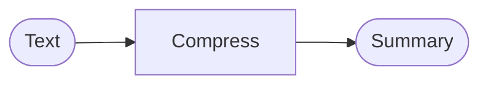

# Recipe: Compress (Summarize)

> [!NOTE]
> Goal: Reduce text into a summary.

The Compress recipe focuses on summarizing input text. It's a simple, single-step recipe that uses a model to condense content.



---

## 1) Quick start

::: code-group

```bash [npm]
npm install ai @ai-sdk/openai
```

```bash [pnpm]
pnpm add ai @ai-sdk/openai
```

```bash [yarn]
yarn add ai @ai-sdk/openai
```

```bash [bun]
bun add ai @ai-sdk/openai
```

:::

<<< @/snippets/recipes/compress/quick-start.js#docs

The artefact contains `compress.summary` with the condensed text.

---

## Implementation

- Source: [`src/recipes/compress/index.ts`](https://github.com/theGeekist/llm-core/blob/main/src/recipes/compress/index.ts)
