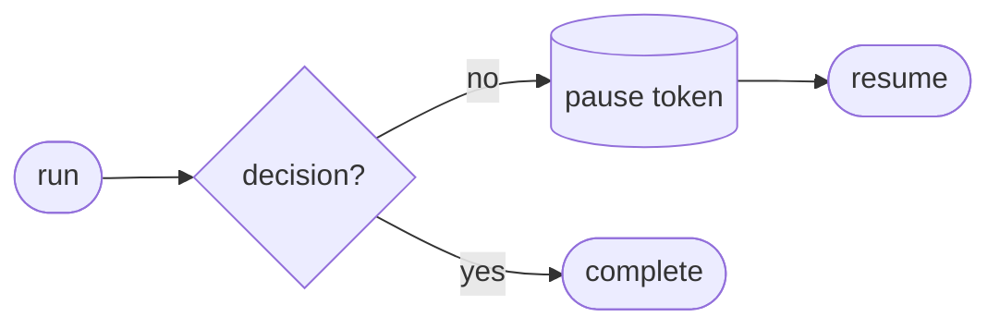

# Recipe: HITL (Human-in-the-Loop Gate)

> [!NOTE] > Goal: Pause a workflow, wait for external input, then resume deterministically.

HITL is a reusable gate recipe. It returns a **paused** outcome until a decision arrives, then resumes with that decision as input. You reach for it when you need explicit approvals, manual verification, policy escalation, or long‑running external jobs such as batch APIs or review queues that must finish before the workflow can continue. The name points to people in the loop, although the gate is more general: the decision can come from a human reviewer, another system, or a scheduled process.

Typical uses include compliance review, risky tool execution, sensitive customer responses, and batch jobs that finish hours later. It turns the intuition of “we should pause here” into a deterministic, auditable step that you can see in the plan and reason about later instead of treating it as a one‑off hack.



---

## 1) Quick start: pause and resume

<<< @/snippets/recipes/hitl/quick-start.js#docs

Outcomes are explicit: `{ status, artefact, diagnostics, trace }`. When the gate pauses, the outcome carries a token and a **partial artefact** snapshot, together with trace and diagnostics that show where and why it paused.

When you resume, the decision input is fed back into the same execution context, so the flow continues from the exact point where it stopped. The artefact contains the draft decision payload and any intermediate outputs that were produced before the pause, which means you can render or review them without re‑running the workflow.

In this setup HITL is the part of the system that introduces the paused outcome into the workflow.

Related: [Runtime -> paused flow](/reference/runtime#paused-flow), [Runtime Outcomes](/reference/runtime#outcomes),
and [Recipes API](/reference/recipes-api).

---

## 2) What you’ll usually configure

Most teams keep the gate simple: a pause, a decision, and a resume. The two common configuration choices are durability and strictness. Durability decides whether you want to survive process restarts. Strictness decides whether you treat missing adapters or invalid tokens as hard errors or as recoverable problems. If you need resume across process restarts, add a cache or checkpoint adapter. Strict diagnostics at runtime will surface missing adapters or invalid tokens as immediate failures instead of letting them slip past.

If you are building a UI, you can treat a paused outcome as a “review task” object: show the draft,
collect a decision, and resume with that decision payload.

---

## 3) Durable resume (cache / checkpoint)

By default, pause tokens are process-local. To resume across restarts, provide a cache or checkpoint adapter.

::: code-group

```bash [npm]
npm install @langchain/langgraph-checkpoint
```

```bash [pnpm]
pnpm add @langchain/langgraph-checkpoint
```

```bash [yarn]
yarn add @langchain/langgraph-checkpoint
```

```bash [bun]
bun add @langchain/langgraph-checkpoint
```

:::

<<< @/snippets/recipes/hitl/durable.js#docs

See: [Adapters -> Cache](/reference/adapters-api#cache-adapters-resume-persistence) and
[Runtime](/reference/runtime).

---

## 4) Diagnostics + trace

You can inspect pause events and reason about why the gate paused.

<<< @/snippets/recipes/hitl/diagnostics.js#docs

Diagnostics act as guardrails here. Missing cache adapters, invalid tokens, or incompatible resume inputs appear immediately in the outcome, and the trace shows exactly where the gate paused.

The mental model stays simple. Each run either completes or pauses, and each resume call uses a token that came from a real pause in the same workflow. That structure removes hidden states and implicit restarts, which makes it easier to understand what happened when you look back at a trace.

---

## 5) Composition (use it as a gate)

Drop the gate into any recipe with `.use()` when you want an explicit stop‑and‑review step in the middle of a larger flow.

<<< @/snippets/recipes/hitl/composition.js#docs

HITL behaves like a checkpoint rather than a transformer. You usually place it inside a larger flow such as [Agent](/recipes/agent) for tool approvals, [RAG](/recipes/rag) for high‑risk answers, or [Ingest](/recipes/ingest) when you need manual validation before indexing.

If you want a quick rule of thumb: place HITL immediately before the action you consider irreversible, and let the gate’s outcome become the human‑visible artefact that you approve or reject.

---

## 6) Why HITL is special

HITL is the only recipe whose primary output is a pause. That makes it the canonical example for long‑wait workflows and deterministic resume semantics. The outcome carries an explicit token, a partial artefact snapshot, and trace and diagnostics that stay attached to the run. When you need a reliable “stop here and wait” primitive, this recipe provides it.

---

## Implementation

Source: [`src/recipes/hitl/index.ts`](https://github.com/theGeekist/llm-core/blob/main/src/recipes/hitl/index.ts)
