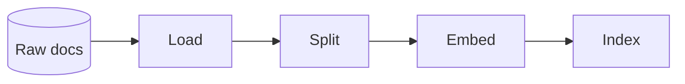

# Recipe: Ingest (ETL for RAG)

> [!NOTE] > Goal: Convert raw sources into vector records, with clear stages and observable failures.

Ingest is a classic ETL flow (load -> split -> embed -> index) built as a **recipe**.
It is designed for repeatable ingestion and incremental re-runs, the “write path” that powers
every serious RAG system. You use it when you want to bring new knowledge into a vector store
without embedding glue into your application code.

Typical use cases include nightly policy syncs, product documentation refreshes, onboarding new
datasets, or batch ingestion for a new tenant. If RAG is the read path, ingest is the write path.

---

## 1) Quick start (loader + splitter + embedder + store)

::: tabs
== JavaScript

<<< @/snippets/recipes/ingest/quick-start.js#docs

== TypeScript

<<< @/snippets/recipes/ingest/quick-start.ts#docs

:::

## 2) Configure per-pack defaults (typed)

Ingest exposes a single config for pack-level defaults. Use it when you want stable wiring
and only override on a per-run basis.

::: tabs
== JavaScript

<<< @/snippets/recipes/ingest/defaults.js#docs

== TypeScript

<<< @/snippets/recipes/ingest/defaults.ts#docs

:::

Related: [Recipe handles](/reference/recipes-api#recipe-handles-the-public-surface) and
[Adapters overview](/adapters/).

This is where you tune the pipeline: chunk size and overlap on the splitter, which embedder to use,
and how the vector store should upsert. Keep run input small; keep behaviour in config.
If you need strict enforcement, run with `runtime.diagnostics = "strict"` so missing adapters or
invalid inputs become errors instead of warnings.

Common tweaks include: smaller chunk sizes for precise retrieval, larger chunks for narrative continuity,
and explicit metadata preservation so citations remain stable. If your embedder supports `embedMany`,
use it — the recipe will take advantage of it automatically.

---

## 3) Mix-and-match adapters

Ingest is adapter-agnostic: you can load with LangChain, embed with AI SDK, and index with
any supported vector store adapter. That lets you swap providers without rewriting ingestion code,
which is especially useful when you migrate vector stores or embedding models.

For example, a real‑world mix might be: LangChain loader + LlamaIndex splitter + AI SDK embeddings +
LlamaIndex vector store. The ingest recipe doesn’t care which ecosystem each adapter came from.

See supported adapter shapes in [Adapters overview](/adapters/).

---

## 4) Diagnostics + trace

Ingest returns full diagnostics and trace on every run. Strict mode turns warnings into failures, which
is a safer default for ingestion pipelines that must be correct. This is where loader errors, invalid
metadata, or failed upserts surface immediately.

<<< @/snippets/recipes/ingest/diagnostics.js#docs

Related: [Runtime -> Diagnostics](/reference/runtime#diagnostics) and
[Runtime -> Trace](/reference/runtime#trace).

---

## 5) Power: reuse + plan

You can inspect the full ETL DAG with `plan()`.

<<< @/snippets/recipes/ingest/composition.js#docs

Ingest composes cleanly with other recipes. Run it before [RAG](/recipes/rag) to refresh the knowledge
base, or pair it with [Agent](/recipes/agent) when you want “ingest then answer” as a single flow.

A common pattern is “ingest nightly, rag on demand.” Another is “ingest on upload, then agent answers
immediately,” which is how you build instant Q&A over new documents.

The mental model is simple: deterministic steps, swappable adapters, and a plan that is always visible.
You get the same runtime guarantees here as everywhere else — explicit outcomes, diagnostics, and trace.

---

## 6) Why Ingest is special

Ingest is the only recipe that is explicitly a write‑path. It transforms raw documents into
vector records and upserts them into a store, which is why it benefits most from strict diagnostics
and stable adapters. If you care about idempotent re‑ingest, this is where `sourceId` and stable
chunk identities matter. It is the foundation for any reliable RAG system.

---

## Implementation

- Source: [`src/recipes/ingest/index.ts`](https://github.com/theGeekist/llm-core/blob/main/src/recipes/ingest/index.ts)
