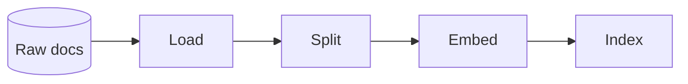

# Recipe: Ingest (ETL for RAG)

> [!NOTE]
> Goal: Convert raw sources into vector records, with clear stages and observable failures.

Ingest is the write side of RAG. It takes raw documents, runs them through an ETL style flow, and
produces vector records that your retrieval pipeline can trust. The stages are familiar:
load, split, embed, then index. The difference is that the whole sequence lives inside a recipe,
so you get a repeatable pipeline instead of one more custom script.

Use this recipe when you want a dependable way to bring new knowledge into a vector store and keep
that process easy to explain. Think of nightly policy syncs, product documentation refreshes,
onboarding new datasets, or batch ingestion for a new tenant.

If RAG is the read path, Ingest is the write path that keeps it supplied.

---

## 1) Quick start (loader, splitter, embedder, store)

The quickest way to use Ingest is to wire a loader, a splitter, an embedder, and a vector store,
then hand the recipe a list of sources.

::: tabs
== JavaScript

<<< @/snippets/recipes/ingest/quick-start.js#docs

== TypeScript

<<< @/snippets/recipes/ingest/quick-start.ts#docs

:::

The outcome shape follows the rest of the workflow runtime: you receive an object with
`status`, `artefact`, `diagnostics`, and `trace`. A successful run gives you the final
upserted records inside the artefact, together with a trace that shows exactly how the
pipeline behaved.

---

## 2) Configure per-pack defaults (typed)

Ingest exposes a single config object for pack level defaults. This is where you describe
how ingestion should work in your project and let individual runs supply only the minimal
inputs.

::: tabs
== JavaScript

<<< @/snippets/recipes/ingest/defaults.js#docs

== TypeScript

<<< @/snippets/recipes/ingest/defaults.ts#docs

:::

Related: [Recipe handles](/reference/recipes-api#recipe-handles-the-public-surface) and
[Adapters overview](/adapters/).

You tune the pipeline here: chunk size and overlap on the splitter, which embedder to use,
and how the vector store should upsert. Run input stays small and focused on what to ingest.
Behaviour and policy live in config.

When you want strict enforcement, run with `runtime.diagnostics = "strict"`. In this mode,
missing adapters or invalid inputs become errors instead of warnings. That suits ingestion
pipelines that must stay correct and predictable across environments.

Common tweaks include:

- Smaller chunk sizes when you want more precise retrieval and tighter context windows.
- Larger chunk sizes when continuity across paragraphs matters more than fine grained recall.
- Explicit metadata preservation so citations and source links remain stable across re-ingest.

If your embedder supports `embedMany`, Ingest will use it. Batching embeddings in this way
often improves throughput and can help control cost.

---

## 3) Mix-and-match adapters

Ingest is adapter agnostic. You can load with LangChain, split with LlamaIndex, embed with
AI SDK, and index with any supported vector store adapter. The recipe calls a small, stable
adapter surface and ignores where each piece came from.

This gives you a practical form of portability. When you migrate vector stores or change
embedding providers, you update the adapters and defaults, while the ingest recipe and
its call sites stay the same.

A real world mix might look like this:

- LangChain document loader
- LlamaIndex splitter
- AI SDK embeddings
- LlamaIndex vector store

From the recipe’s point of view, this is still one ingest pipeline.

See supported adapter shapes in the
[Adapters overview](/adapters/) and the
[Retrieval adapters](/adapters/retrieval) page.

---

## 4) Diagnostics and trace

Every ingest run returns full diagnostics and trace. Strict mode promotes key warnings
into errors, which works especially well in environments where ingestion failures should
stop the pipeline instead of hiding in logs.

<<< @/snippets/recipes/ingest/diagnostics.js#docs

Related: [Runtime diagnostics](/reference/runtime#diagnostics) and
[Runtime trace](/reference/runtime#trace).

You can inspect loader errors, invalid metadata, failed upserts, and adapter level issues
in one place, and the trace shows the order of steps and decisions taken along the way.

---

## 5) Power: reuse and explain

You can inspect the full ETL plan with `explain()`. This renders the recipe’s internal
DAG, so you can see loading, splitting, embedding, and indexing as distinct steps rather
than a black box.

<<< @/snippets/recipes/ingest/composition.js#docs

Ingest composes cleanly with other recipes. Run it before
[RAG](/recipes/rag) to refresh the knowledge base, or pair it with
[Agent](/recipes/agent) when you want "ingest then answer" as a single flow.

A common pattern is nightly ingest paired with on demand RAG. Another pattern ingests
on upload so an agent can answer questions over new documents in the same flow.

The mental model stays simple. You work with deterministic steps, swappable adapters,
and an execution plan that you can always inspect.

---

## 6) Why Ingest is special

Ingest is the recipe that handles the write path. It transforms raw documents into
vector records and upserts them into a store, so RAG has a reliable foundation and
clear provenance for its context.

This is where strict diagnostics and stable adapters pay off most. Idempotent re-ingest
relies on consistent `sourceId` values and stable chunk identities, and the recipe
helps you express those choices in one place.

When you want RAG that behaves like a proper system instead of a one-off experiment,
Ingest is usually where you start.

---

## Implementation

- Source: [`src/recipes/ingest/index.ts`](https://github.com/theGeekist/llm-core/blob/main/src/recipes/ingest/index.ts)
